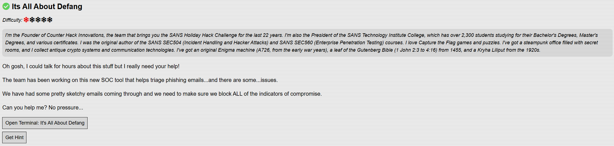
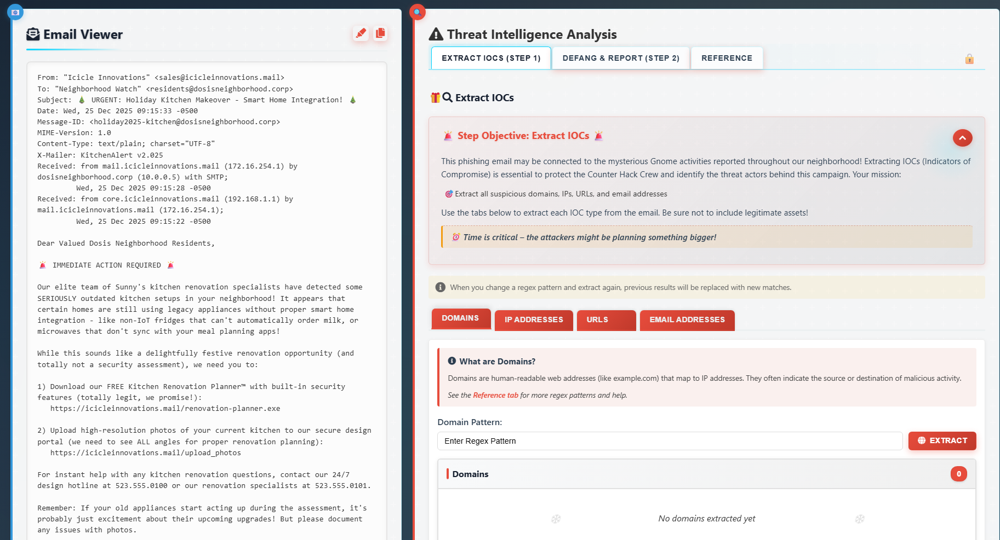
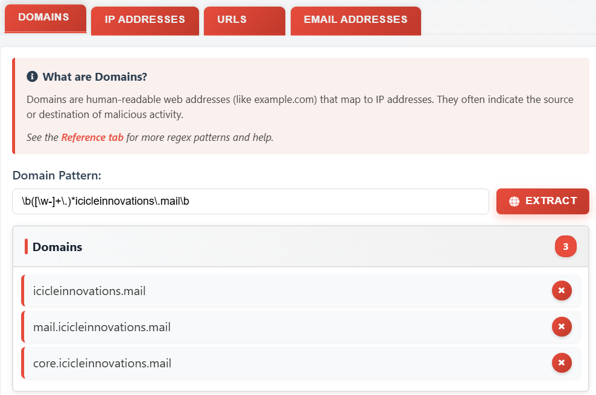
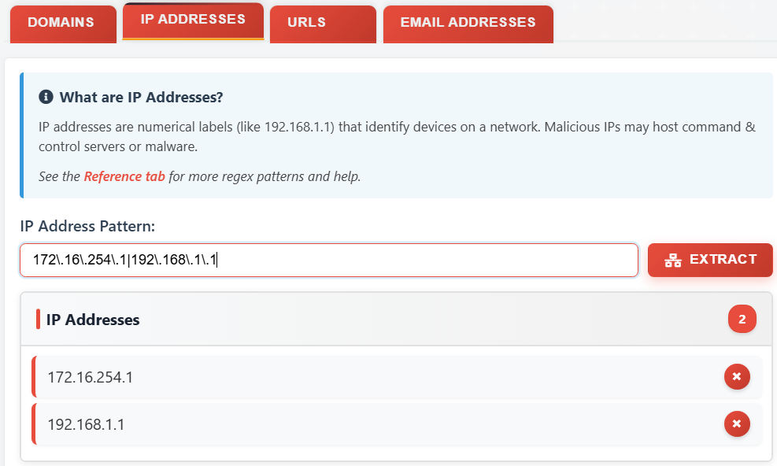
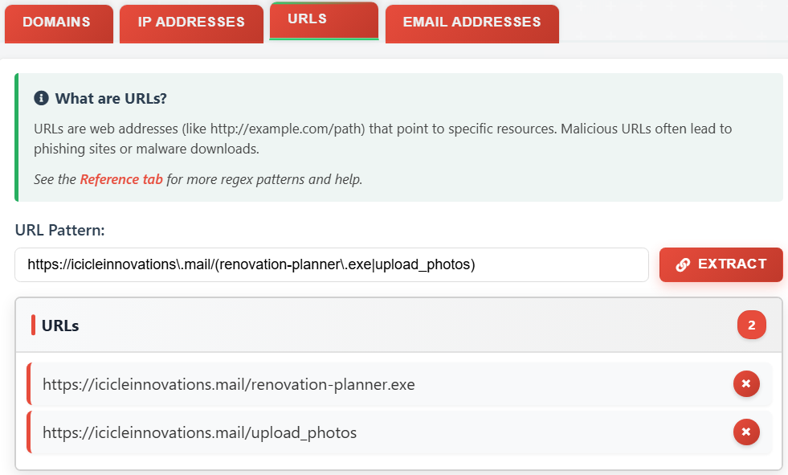
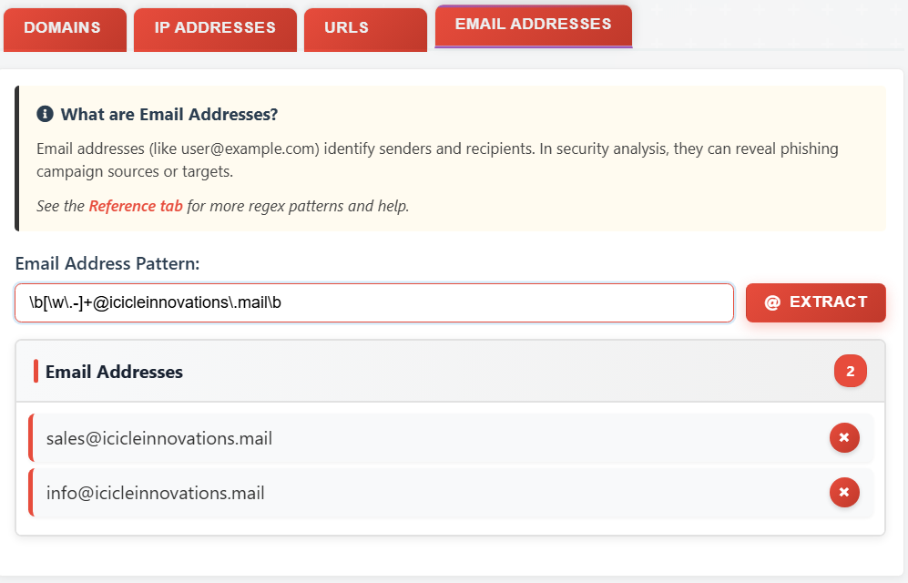
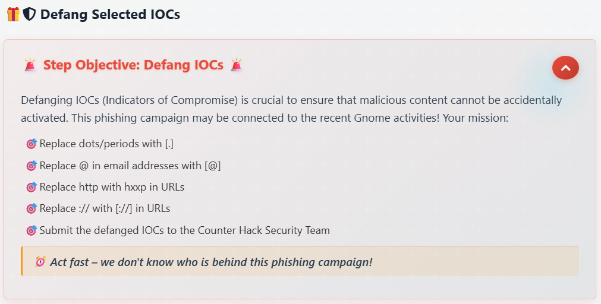
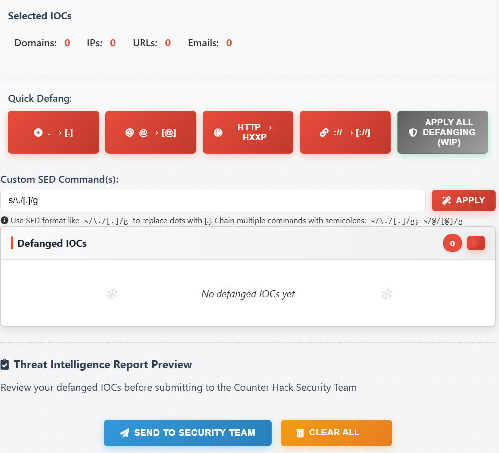
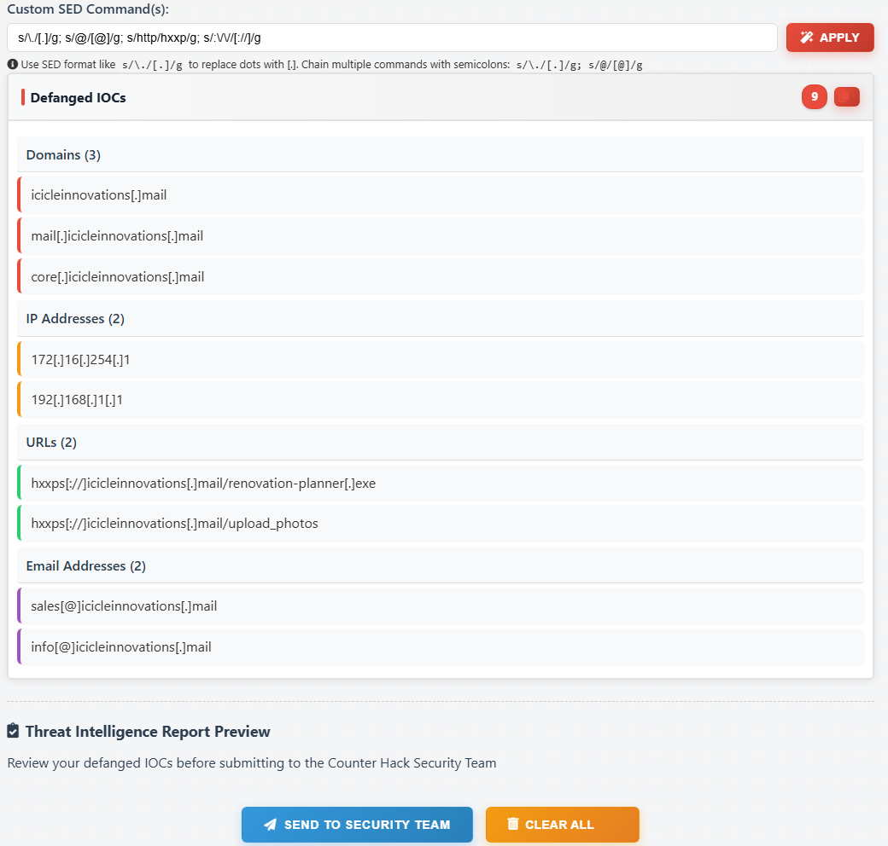
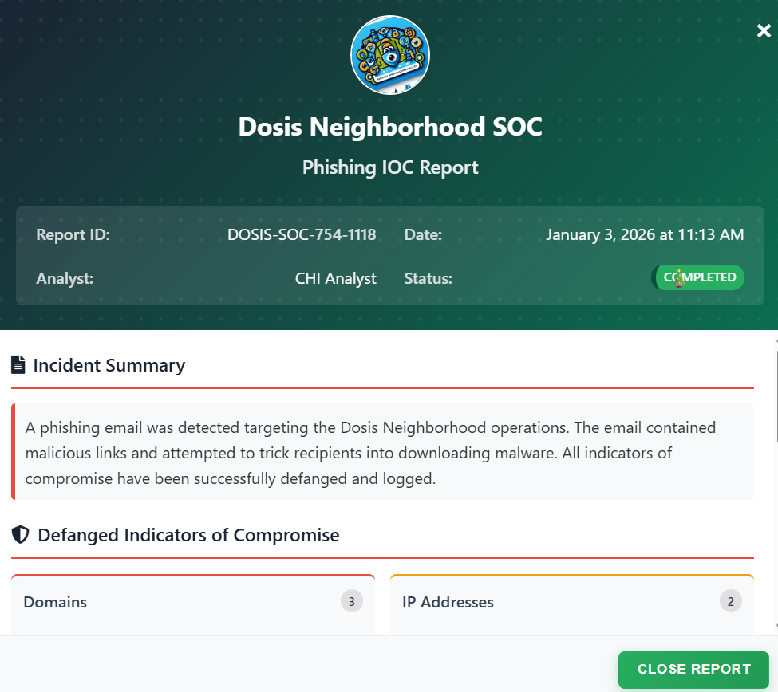

# Its All About Defang

## Challenge Objective 



## Challenge Solution

### Step 1 - Extract IOCs - Intro

When I open the terminal for the challenge, I see a web interface for the team SOC tool mentioned in the challenge objective. 

The team needs help with blocking ALL of the IOCs to stop bad emails from getting through. This challenge involves using Threat Intelligence Analysis based on reading the phishing email on the left. I must extract the IOCs from the email, and then Defang & Report. 



This challenge involves using Regex Patterns to extract IOCs from the below phishing email that's shown in the left Email Viewer.


```
From: "Icicle Innovations" <sales@icicleinnovations.mail>
To: "Neighborhood Watch" <residents@dosisneighborhood.corp>
Subject: 🎄 URGENT: Holiday Kitchen Makeover - Smart Home Integration! 🎄
Date: Wed, 25 Dec 2025 09:15:33 -0500
Message-ID: <holiday2025-kitchen@dosisneighborhood.corp>
MIME-Version: 1.0
Content-Type: text/plain; charset="UTF-8"
X-Mailer: KitchenAlert v2.025
Received: from mail.icicleinnovations.mail (172.16.254.1) by dosisneighborhood.corp (10.0.0.5) with SMTP;
         Wed, 25 Dec 2025 09:15:28 -0500
Received: from core.icicleinnovations.mail (192.168.1.1) by mail.icicleinnovations.mail (172.16.254.1);
         Wed, 25 Dec 2025 09:15:22 -0500

Dear Valued Dosis Neighborhood Residents, 

🚨 IMMEDIATE ACTION REQUIRED 🚨

Our elite team of Sunny's kitchen renovation specialists have detected some SERIOUSLY outdated kitchen setups in your neighborhood! It appears that certain homes are still using legacy appliances without proper smart home integration - like non-IoT fridges that can't automatically order milk, or microwaves that don't sync with your meal planning apps! 

While this sounds like a delightfully festive renovation opportunity (and totally not a security assessment), we need you to:

1) Download our FREE Kitchen Renovation Planner™ with built-in security features (totally legit, we promise!):
   https://icicleinnovations.mail/renovation-planner.exe
   
2) Upload high-resolution photos of your current kitchen to our secure design portal (we need to see ALL angles for proper renovation planning):
   https://icicleinnovations.mail/upload_photos

For instant help with any kitchen renovation questions, contact our 24/7 design hotline at 523.555.0100 or our renovation specialists at 523.555.0101.

Remember: If your old appliances start acting up during the assessment, it's probably just excitement about their upcoming upgrades! But please document any issues with photos.

Stay merry (and consider smart upgrades),
Icicle Innovations 
Chief Kitchen Design Specialist
📞 523.555.RENO
info@icicleinnovations.mail

P.S. - Has anyone else noticed their kitchen cabinets mysteriously rearranging themselves overnight? We can fix that with proper smart storage solutions!
```

In the interface for this tool are the tabs to extract each IOC type with Regex. So at a high level, the goal is to look through the above email for suspicious domains, IPs, URLs, or email addresses -> get the Regex pattern -> extract info. 

### Step 1 - Extract IOCs - Domains

Looking through the email, I see the below suspicious domain.

* ```icicleinnovations.mail``` - This is the domain from where the phishing email was sent. Since I already know this email is from a bad sender and this is the domain from where it was sent, I want to block it.

I want to extract any and all instances of the above domain. After taking a look at some of the materials in the reference tab on the site and doing other research, I used the below pattern to find the domains and extract them.

```\b([\w-]+\.)*icicleinnovations\.mail\b```

This pattern matches the domain ```icicleinnovations.mail```, including any number of subdomains. This works successfully and all of the suspicious domains are extracted, catching ones I didn't see before in my previous attempts. 



### Step 1 - Extract IOCs - IP Addresses

The next step is to look for the suspicious IP addresses. Taking a look at the email, I see the below suspicious IPs.

* ```172.16.254.1``` - Next to a suspicious domain in the Received field of the email, for mail.icicleinnovations.mail. 
* ```192.168.1.1``` - Next to a suspicious domain in a Received field of the email, for core.icicleinnovations.mail.  

```172\.16\.254\.1|192\.168\.1\.1```

```172\.16\.254\.1``` matches the literal IP 172.16.254.1, | is the OR operator, and ```192\.168\.1\.1``` matches the literal IP 192.168.1.1.

I know these are the offending IPs since they're next to the suspicious domains found earlier in the challenge. The other IP shown in the email is for the receiver (10.0.0.5). The pattern works and the suspicious IPs that correlate to the previous suspicious domains are captured as an IOC. 



### Step 1 - Extract IOCs - URLs

Now I need to look for the suspicious URLs next. Looking through the email, I found the below.

* ```https://icicleinnovations.mail/renovation-planner.exe``` - The "free" kitchen renovation planner.  
* ```https://icicleinnovations.mail/upload_photos``` - The "secure" design portal to upload pictures of the kitchen to.  

I need to input a Regex pattern that includes both of these URLs. So, I'm looking for one that is a literal match for anything with icicleinnovations.mail/.

```https://icicleinnovations\.mail/(renovation-planner\.exe|upload_photos)``` 

This pattern matches the two suspicious URLs above on the same domain. 



### Step 1 - Extract IOCs - Email Addresses

Here is the last part of Step 1 for this challenge, finding the suspicious email addresses and creating the Regex pattern to extract them as an IOC. 

The suspicious email addresses are:

* ```sales@icicleinnovations.mail``` - The sender of the suspicious email.
* ```info@icicleinnovations.mail``` - At the bottom of the email signature.

Now that I have these, it's time to find a Regex pattern that matches these. So, I need a pattern to look for anything ending in @icicleinnovations.mail to capture future emails from this domain.

```\b[\w\.-]+@icicleinnovations\.mail\b```

This pattern matches email addresses at the icicleinnovations.mail domain. With this, Step 1 of this challenge is completed. 



### Step 2 - Defang & Report

After extracting the IOCs, now I have to defang them. When discussing IOCs specifically, defanging means adding text to an IOC so that it doesn't become a link when presented in mediums like emails, websites, files, etc. 



I have to use SED formatted commands to accomplish the above tasks before sending the defanged IOCs over to the Counter Hack Security Team. Scrolling down within the terminal for this challenge, I see where I need to input the custom SED commands to defang the previously discovered IOCs.



SED Commands:
* ```s/\./[.]/g``` - Replace dots/periods with [.] 
* ```s/@/\[@\]/g``` - Replace @ in email addresses with [@] 
* ```s/http/hxxp/g``` - Replace http with hxxp in URLs 
* ```s/:\/\//[://]/g``` - Replace :// with [://] in URLs 

These commands all worked individually, but I wanted to combine them and double check that everything was captured.
* ```s/\./[.]/g; s/@/[@]/g; s/http/hxxp/g; s/:\/\//[://]/g``` - Combines the above four SED commands into one line. 



Now that I see that the combined SED command worked to accomplish the defanging tasks, I click the button at the bottom to send the report to the Counter Hack Security Team. 



This completes this challenge. I can see the Incident Summary, Defanged IOCs (shown above), and the Actions Taken section below.

Actions Taken
* All IOCs have been defanged using proper security techniques
* Indicators added to the North Pole threat intelligence platform
* Security blocks deployed to all endpoints
* Email filtering rules updated to catch similar phishing attempts   