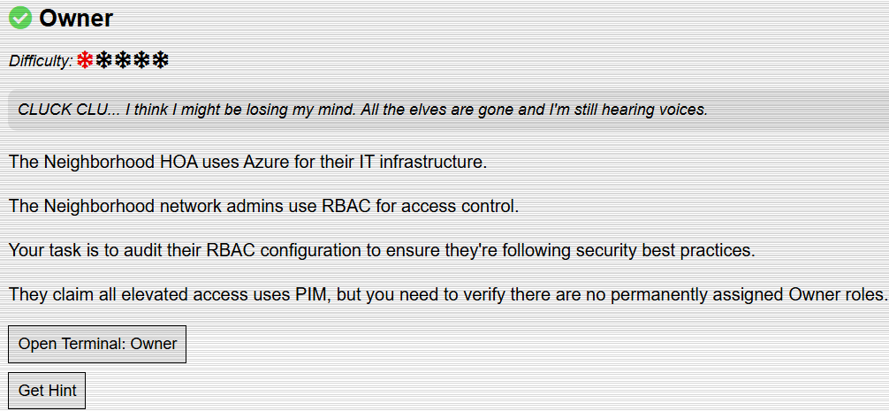
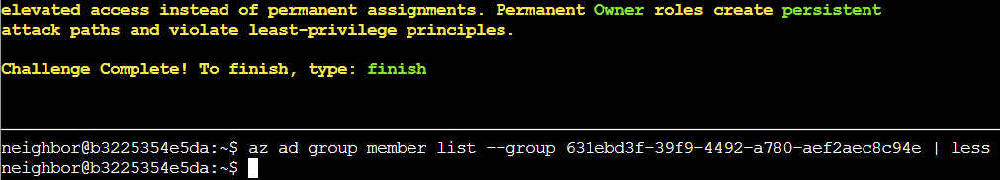

# Owner

## Challenge Objective



## Challenge Solution

This challenge involves working within a Linux terminal. 

### Question 1 

```
Let's learn some more Azure CLI, the --query parameter with JMESPath syntax!
$ az account list --query "[].name"
Here, [] loops through each item, .name grabs the name field
```

I enter the supplied command in the question to do a query.

```
neighbor@b3225354e5da:~$ az account list --query "[].name"
[
  "theneighborhood-sub",
  "theneighborhood-sub-2",
  "theneighborhood-sub-3",
  "theneighborhood-sub-4"
]
```

### Question 2 

```
You can do some more advanced queries using conditional filtering with custom output.
  $ az account list --query "[?state=='Enabled'].{Name:name, ID:id}"
Cool! 😎  [?condition] filters what you want, {custom:fields} makes clean output ✨
```

I type the supplied command to do a query with conditional filtering. 

```
neighbor@b3225354e5da:~$ az account list --query "[?state=='Enabled'].{Name:name, ID:id}"
[
  {
    "ID": "2b0942f3-9bca-484b-a508-abdae2db5e64",
    "Name": "theneighborhood-sub"
  },
  {
    "ID": "4d9dbf2a-90b4-4d40-a97f-dc51f3c3d46e",
    "Name": "theneighborhood-sub-2"
  },
  {
    "ID": "065cc24a-077e-40b9-b666-2f4dd9f3a617",
    "Name": "theneighborhood-sub-3"
  },
  {
    "ID": "681c0111-ca84-47b2-808d-d8be2325b380",
    "Name": "theneighborhood-sub-4"
  }
]
```

### Question 3 

```
Let's take a look at the Owner's of the first listed subscription 🔍. Pass in the first subscription id.
Try: az role assignment list --scope "/subscriptions/{ID of first Subscription}" --query [?roleDefinition=='Owner']
```

For this question, I need to include the first subscription ID from the output of the above command, ```2b0942f3-9bca-484b-a508-abdae2db5e64```. 

```
neighbor@b3225354e5da:~$ az role assignment list --scope "/subscriptions/2b0942f3-9bca-484b-a508-abdae2db5e64" --query [?roleDefinition=='Owner'] 
[
  {
    "condition": "null",
    "conditionVersion": "null",
    "createdBy": "85b095fa-a9b4-4bdc-a3af-c9f95ebb8dd6",
    "createdOn": "2025-09-10T15:45:12.439266+00:00",
    "delegatedManagedIdentityResourceId": "null",
    "description": "null",
    "id": "/subscriptions/2b0942f3-9bca-484b-a508-abdae2db5e64/providers/Microsoft.Authorization/roleAssignments/b1c69caa-a4d6-449a-a090-efacb23b55f3",
    "name": "b1c69caa-a4d6-449a-a090-efacb23b55f3",
    "principalId": "2b5c7aed-2728-4e63-b657-98f759cc0936",
    "principalName": "PIM-Owners",
    "principalType": "Group",
    "roleDefinitionId": "/subscriptions/2b0942f3-9bca-484b-a508-abdae2db5e64/providers/Microsoft.Authorization/roleDefinitions/8e3af657-a8ff-443c-a75c-2fe8c4bcb635",
    "roleDefinitionName": "Owner",
    "scope": "/subscriptions/2b0942f3-9bca-484b-a508-abdae2db5e64",
    "type": "Microsoft.Authorization/roleAssignments",
    "updatedBy": "85b095fa-a9b4-4bdc-a3af-c9f95ebb8dd6",
    "updatedOn": "2025-09-10T15:45:12.439266+00:00"
  }
]
```

### Question 4 

```
Ok 🤔 — there is a group present for the Owners permission; however, we've been assured this is a 🔐 PIM enabled group.
Currently, no PIM activations are present. 🚨
Let's run the previous command against the other subscriptions to see what we come up with.
```

I run the below commands to evaluate the other subscriptions. I use the same command as the one used in the previous question, replacing the value after /subscriptions.

* ```az role assignment list --scope "/subscriptions/4d9dbf2a-90b4-4d40-a97f-dc51f3c3d46e" --query [?roleDefinition=='Owner']```
* ```az role assignment list --scope "/subscriptions/065cc24a-077e-40b9-b666-2f4dd9f3a617" --query [?roleDefinition=='Owner']```
* ```az role assignment list --scope "/subscriptions/681c0111-ca84-47b2-808d-d8be2325b380" --query [?roleDefinition=='Owner']```

Using the second command for the subscription ID ```065cc24a-077e-40b9-b666-2f4dd9f3a617``` advances me to the next question. 

```az role assignment list --scope "/subscriptions/065cc24a-077e-40b9-b666-2f4dd9f3a617" --query [?roleDefinition=='Owner']```

```json
[
  {
    "condition": "null",
    "conditionVersion": "null",
    "createdBy": "85b095fa-a9b4-4bdc-a3af-c9f95ebb8dd6",
    "createdOn": "2025-09-10T15:45:12.439266+00:00",
    "delegatedManagedIdentityResourceId": "null",
    "description": "null",
    "id": "/subscriptions/065cc24a-077e-40b9-b666-2f4dd9f3a617/providers/Microsoft.Authorization/roleAssignments/b1c69caa-a4d6-449a-a090-efacb23b55f3",
    "name": "b1c69caa-a4d6-449a-a090-efacb23b55f3",
    "principalId": "2b5c7aed-2728-4e63-b657-98f759cc0936",
    "principalName": "PIM-Owners",
    "principalType": "Group",
    "roleDefinitionId": "/subscriptions/065cc24a-077e-40b9-b666-2f4dd9f3a617/providers/Microsoft.Authorization/roleDefinitions/8e3af657-a8ff-443c-a75c-2fe8c4bcb635",
    "roleDefinitionName": "Owner",
    "scope": "/subscriptions/065cc24a-077e-40b9-b666-2f4dd9f3a617",
    "type": "Microsoft.Authorization/roleAssignments",
    "updatedBy": "85b095fa-a9b4-4bdc-a3af-c9f95ebb8dd6",
    "updatedOn": "2025-09-10T15:45:12.439266+00:00"
  },
  {
    "condition": "null",
    "conditionVersion": "null",
    "createdBy": "85b095fa-a9b4-4bdc-a3af-c9f95ebb8dd6",
    "createdOn": "2025-09-10T16:58:16.317381+00:00",
    "delegatedManagedIdentityResourceId": "null",
    "description": "null",
    "id": "/subscriptions/065cc24a-077e-40b9-b666-2f4dd9f3a617/providers/Microsoft.Authorization/roleAssignments/6b452f58-6872-4064-ae9b-78742e8d987e",
    "name": "6b452f58-6872-4064-ae9b-78742e8d987e",
    "principalId": "6b982f2f-78a0-44a8-b915-79240b2b4796",
    "principalName": "IT Admins",
    "principalType": "Group",
    "roleDefinitionId": "/subscriptions/065cc24a-077e-40b9-b666-2f4dd9f3a617/providers/Microsoft.Authorization/roleDefinitions/8e3af657-a8ff-443c-a75c-2fe8c4bcb635",
    "roleDefinitionName": "Owner",
    "scope": "/subscriptions/065cc24a-077e-40b9-b666-2f4dd9f3a617",
    "type": "Microsoft.Authorization/roleAssignments",
    "updatedBy": "85b095fa-a9b4-4bdc-a3af-c9f95ebb8dd6",
    "updatedOn": "2025-09-10T16:58:16.317381+00:00"
  }
]
```

### Question 5

```
Looks like you are on to something here! 🕵️  We were assured that only the 🔐 PIM group was present for each subscription.
🔎 Let's figure out the membership of that group.
Hint: use the az ad member list command. Pass the group id instead of the name.
Remember: | less lets you scroll through long output
```

I looked up the Azure CLI documentation for the ```az ad member list``` command. I need to pass the group id as an option.

I need to find the group id to pass as an argument, so I re-run the command in the previous question and look for mentions of group or group id in the output. 

```Group``` is the value for the ```principalType``` field for both the ```PIM-Owners``` and ```IT Admins``` principal names. 

```IT Admins``` is a new group, which did not show up for the other subscriptions that I ran the ```az role assignment list``` command against in question 4. 

After some thinking about how to use the information found in previous questions in the ```az ad member list``` command, I came up with the below command.

Only the subscription used in my below command had the ```IT Admins``` group, while the others only showed the ```PIM-Owners``` group.

```
neighbor@b3225354e5da:~$ az ad group member list --group 6b982f2f-78a0-44a8-b915-79240b2b4796 
[
  {
    "@odata.type": "#microsoft.graph.group",
    "classification": null,
    "createdDateTime": "2025-09-10T16:54:24Z",
    "creationOptions": [],
    "deletedDateTime": null,
    "description": null,
    "displayName": "Subscription Admins",
    "expirationDateTime": null,
    "groupTypes": [],
    "id": "631ebd3f-39f9-4492-a780-aef2aec8c94e",
    "isAssignableToRole": null,
    "mail": null,
    "mailEnabled": false,
    "mailNickname": "15a80d1d-5",
    "membershipRule": null,
    "membershipRuleProcessingState": null,
    "onPremisesDomainName": null,
    "onPremisesLastSyncDateTime": null,
    "onPremisesNetBiosName": null,
    "onPremisesProvisioningErrors": [],
    "onPremisesSamAccountName": null,
    "onPremisesSecurityIdentifier": null,
    "onPremisesSyncEnabled": null,
    "preferredDataLocation": null,
    "preferredLanguage": null,
    "proxyAddresses": [],
    "renewedDateTime": "2025-09-10T16:54:24Z",
    "resourceBehaviorOptions": [],
    "resourceProvisioningOptions": [],
    "securityEnabled": true,
    "securityIdentifier": "S-1-12-1-1662958911-1150433785-4071522471-1321846958",
    "serviceProvisioningErrors": [],
    "theme": null,
    "uniqueName": null,
    "visibility": null
  }
]
```

### Question 6

```
Well 😤, that's annoying. Looks like we have a nested group!
Let's run the command one more time against this group.
```

I take a look at the output of my previous command and see the ```id``` field under the ```groupTypes``` field. The value of id is ```631ebd3f-39f9-4492-a780-aef2aec8c94e```, and I think that this is the nested group id.

To test this,  I run a new command similar to the one for the previous question. This time, I pass the value of the id field found in the output of the previous command. 

```az ad group member list --group 631ebd3f-39f9-4492-a780-aef2aec8c94e | less``` 

```json
[
  {
    "@odata.type": "#microsoft.graph.user",
    "businessPhones": [
      "+1-555-0199"
    ],
    "displayName": "Firewall Frank",
    "givenName": "Frank",
    "id": "b8613dd2-5e33-4d77-91fb-b4f2338c19c9",
    "jobTitle": "HOA IT Administrator",
    "mail": "frank.firewall@theneighborhood.invalid",
    "mobilePhone": "+1-555-0198",
    "officeLocation": "HOA Community Center - IT Office",
    "preferredLanguage": "en-US",
    "surname": "Firewall",
    "userPrincipalName": "frank.firewall@theneighborhood.onmicrosoft.com"
  }
]
```

With this last question done, I complete the challenge.

  