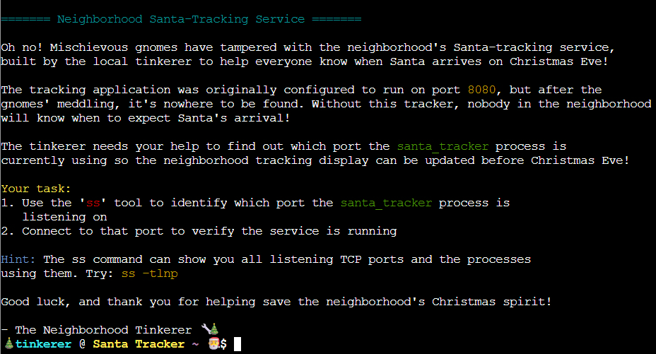
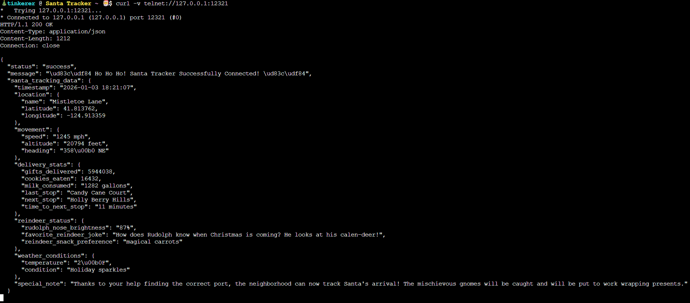

# Santa's Gift-Tracking Service Port Mystery

## Challenge Objective


## Challenge Solution 

This challenge is completed within a Linux terminal. The context and goal is at the top of the terminal, with space to enter my commands at the bottom. 



First, I look to accomplish Task 1 of using the ss tool to identify which port the ```santa_tracker``` process is listening on. 

The hint at the top of the window says to run ```ss –tlnp``` to see all listening TCP ports and the processes using them. I do that and see just one line of output for port 12321 on all network interfaces.

```
🎄 tinkerer @ Santa Tracker ~ 🎅 $ ss -tlnp
State                      Recv-Q                     Send-Q                                          Local Address:Port                                            Peer Address:Port                     Process                     
LISTEN                     0                          5                                                     0.0.0.0:12321                                                0.0.0.0:*                                                    
```

I see just one line of output for port 12321 on all network interfaces. I want to now connect to port 12321 to verify if the service is running there. 

Looking at the challenge objective before accessing the terminal, cURL is mentioned. So I think about how I can use cURL to connect to this port.

I look up how to use cURL to connect to a TCP port, and see that Telnet can be used to achieve this.

After some experimentation, I ran the below command to solve the challenge.

   