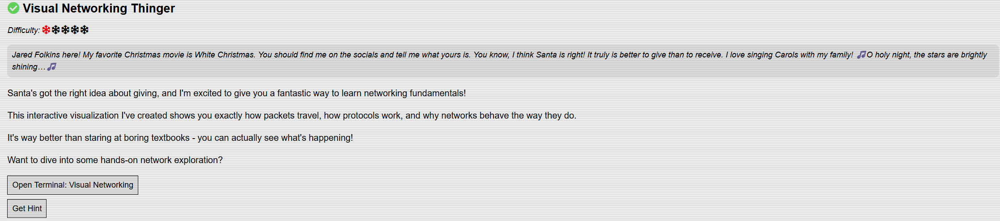
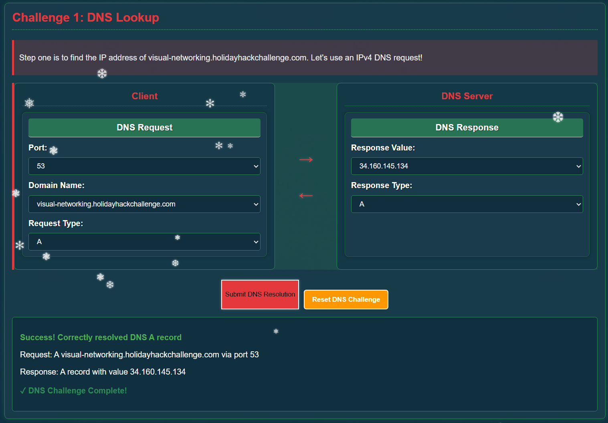
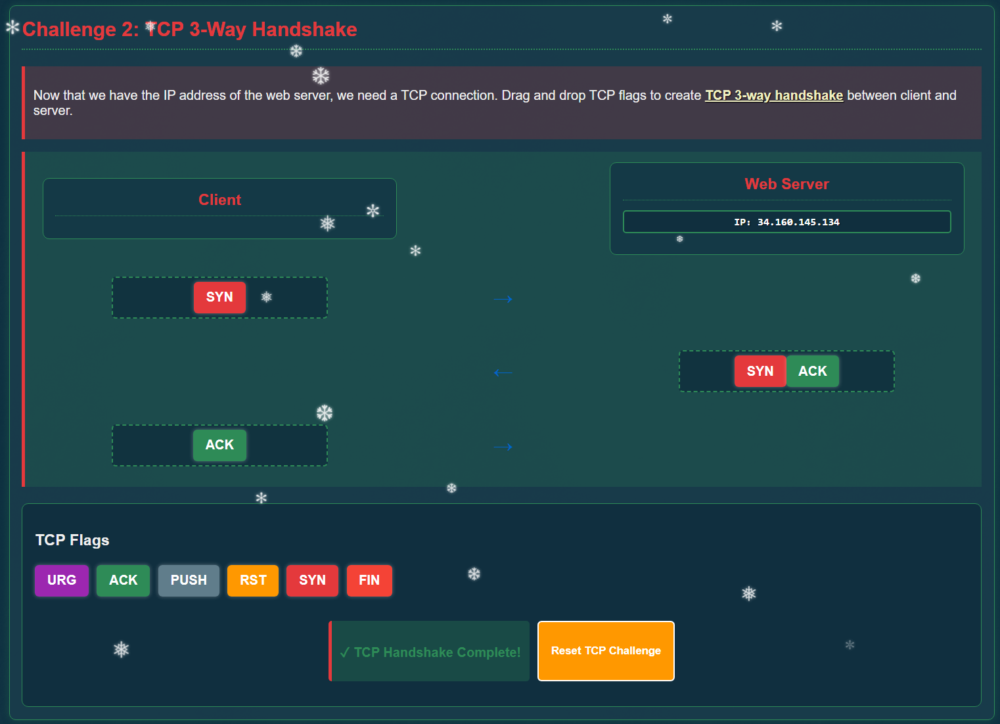
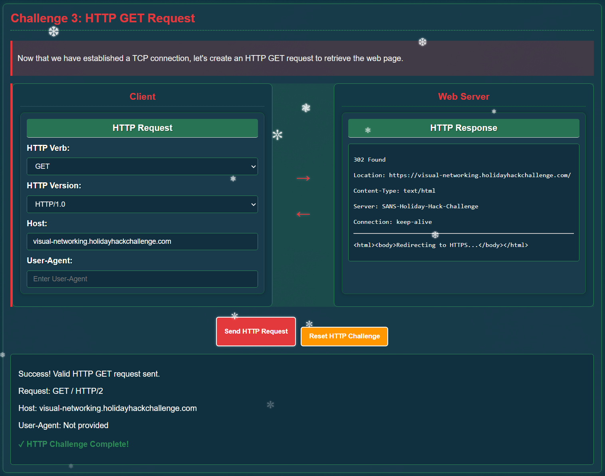
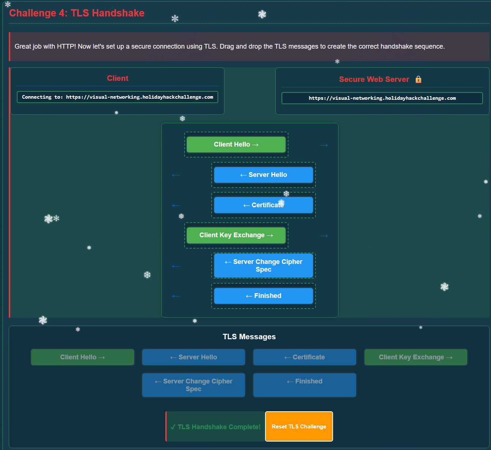
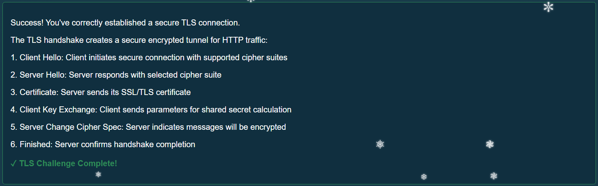
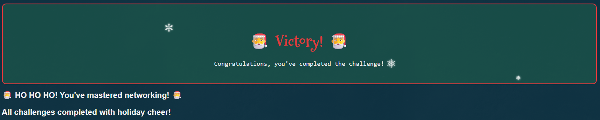

# Visual Networking Thinger

## Challenge Objective 

## Challenge Solution

Clicking on the open terminal button opens a new tab in my browser to the [Holiday Networking Challenge](https://visual-networking.holidayhackchallenge.com/). This challenge is broken up into five different networking challenges, where I must select the right answer for each challenge to proceed. 

### Challenge 1: DNS Lookup

I set the Domain Name field to the target, and then select the A request type since I'm trying to get an IPv4 DNS request. For the port I select 53, the typical port used for DNS.

For the Response Type field, it should be A since I'm looking for the IPv4 address. The response value is the IP address.  

### Challenge 2: TCP 3-Way Handshake

A TCP Handshake has the following high level steps:

1. Client sends a SYN to the Server 
2. Server sends a SYN/ACK to the Client 
3. Client sends an ACK to the Server 

After filling in the cells in the challenge to match this, I complete this challenge.   

### Challenge 3: Challenge 3: HTTP GET Request

The right HTTP Verb to select is GET, since the challenge tells me to create a GET request to retrieve the web page. 

The HTTP Version selected doesn't matter, in that all of them work if the other selections are correct.

The Host is already filled in, and cannot be changed. Lastly, I left the User-Agent field blank.

### Challenge 4: TLS Handshake

For this, I looked up the steps of the TLS handshake to refresh my memory. After doing some reading and getting a better understanding of what happens at a high level, I input my choices to complete this challenge. 

All of the options can be used only once, and they must be in the right order to move on. Below the challenge success message is a nice summary of the TLS Handshake steps in order. 

### Challenge 5: HTTPS GET Request

This last question for this challenge involves making an HTTPS request to retrieve the website securely.

The HTTP Verb is GET, since I'm trying to retrieve the website.

For the HTTP Version, I selected HTTP/1.1 and left the User-Agent field blank. 

With this last of the five questions within this challenge complete, and the challenge is solved.

  