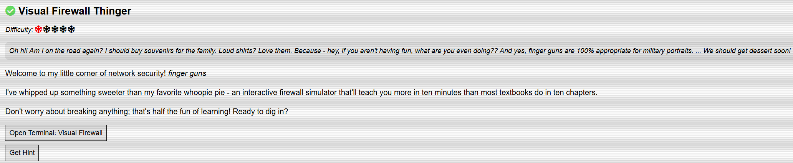
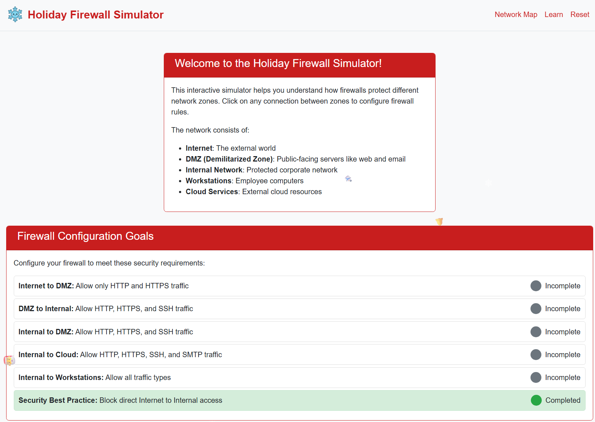
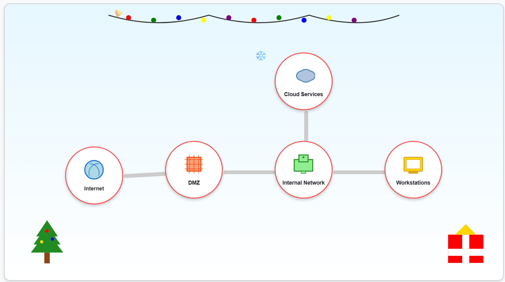
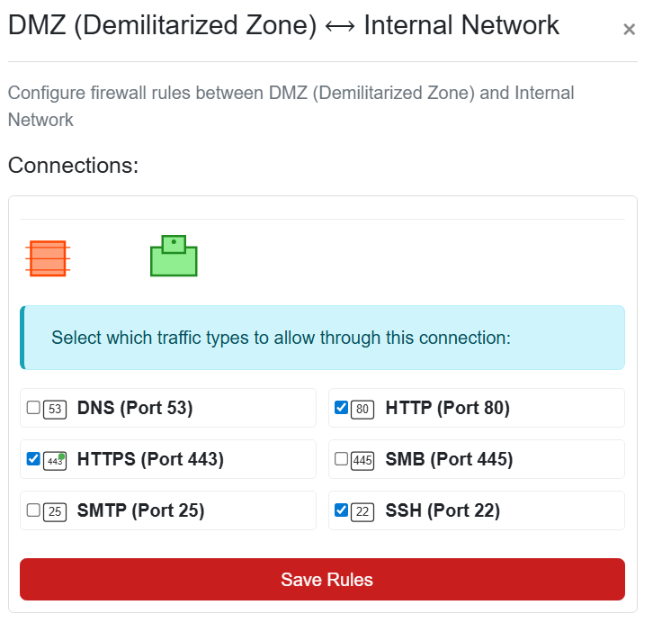
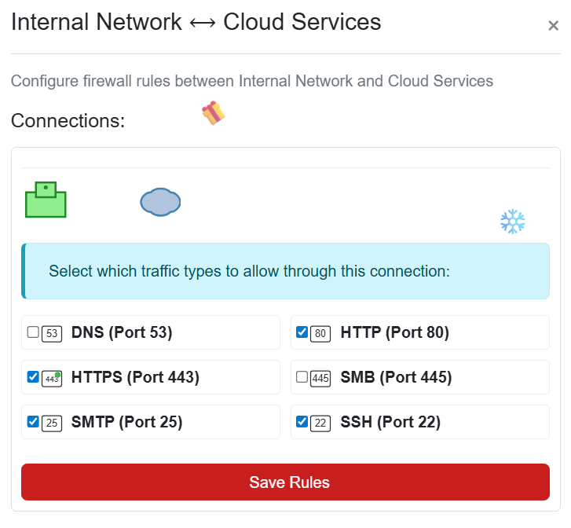
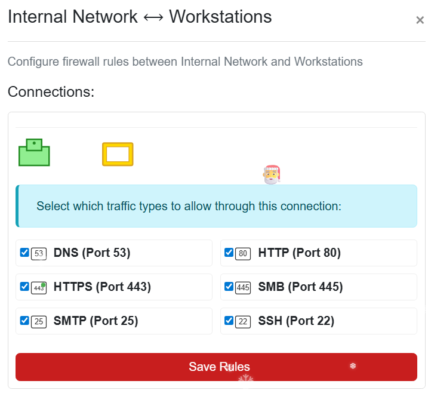

# Visual Firewall Thinger

## Challenge Objective 

## Challenge Solution

Clicking on the open terminal window shows a pop-up to the site for this challenge at [Holiday Firewall Simulator](https://visual-firewall.holidayhackchallenge.com/).

This challenge is another interactive simulator, covering firewalls and network segmentation.

Clicking on any of the connections (the lines between the zones) allows me to configure the firewall rules to complete the goals above. The bottom goal in the above screenshot is already completed. This is because in the network map below, there is a DMZ between the Internet and the Internal Network. 

### Internet to DMZ: Allow only HTTP and HTTPS traffic

I click the connection between the Internet and DMZ in the network map to change the rules. 

Since I want traffic to flow from the Internet and DMZ (exposed part of the network) - I select HTTPS (Port 443) and HTTP (Port 80) and save rules. This completes this part of the challenge. 

### DMZ to Internal: Allow HTTP, HTTPS, and SSH traffic 

I click the connection between the DMZ and the Internal Network in the network map to change the rules. 

I select the desired traffic options (HTTP, HTTPS, SSH) and save the rules to complete this part of the challenge. 

### Internal to DMZ: Allow HTTP, HTTPS, and SSH traffic

This goal autocompleted after saving the rules for DMZ to Internal above, which makes sense since this is the same flow as the previous question but in the opposite direction. 

### Internal to Cloud: Allow HTTP, HTTPS, SSH, and SMTP traffic

I click the connection between the Internal Network and the Cloud in the network map to change the rules. 

I select the desired traffic options and save the rules to complete this part of the challenge.

### Internal to Workstations: Allow all traffic types

I click the connection between the Internal Network and Workstations in the network map to change the rules.

I select the desired traffic options and save the rules to complete this last goal in the challenge. Now the challenge is fully completed.

  