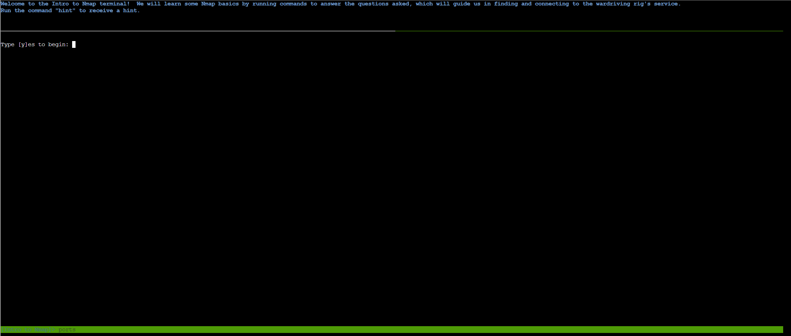
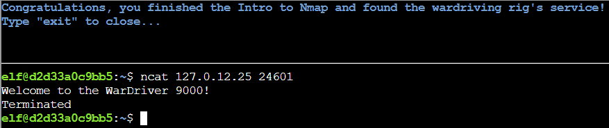

# Intro to Nmap

## Challenge Objective  


## Challenge Solution

Clicking on open terminal shows a Linux terminal, where at the top section I see the questions for the challenge, and at the bottom section I type in my commands. 



I type y in the terminal to proceed with the questions. 

### Question 1

* When run without any options, nmap performs a TCP port scan of the top 1000 ports. Run a default nmap scan of 127.0.12.25 and see which port is open.

```
elf@3bacb45bbf0f:~$ nmap 127.0.12.25
Starting Nmap 7.80 ( https://nmap.org ) at 2026-01-03 20:04 UTC
Nmap scan report for 127.0.12.25
Host is up (0.000066s latency).
Not shown: 999 closed ports
PORT     STATE SERVICE
8080/tcp open  http-proxy

Nmap done: 1 IP address (1 host up) scanned in 0.10 seconds
elf@3bacb45bbf0f:~$ 
```

I am told to run Nmap without any options, and I'm given a target IP address. The general syntax for an Nmap command is ```nmap <options> <target>```. I run the above command to complete this question. 

### Question 2

* Sometimes the top 1000 ports are not enough. Run an nmap scan of all TCP ports on 127.0.12.25 and see which port is open.

```
elf@dbd6793ebd62:~$ nmap -sT -p- 127.0.12.25
Starting Nmap 7.80 ( https://nmap.org ) at 2026-01-03 20:11 UTC
Nmap scan report for 127.0.12.25
Host is up (0.000095s latency).
Not shown: 65534 closed ports
PORT      STATE SERVICE
24601/tcp open  unknown

Nmap done: 1 IP address (1 host up) scanned in 2.17 seconds
```

```-sT``` is the option for the TCP connect scan, which I use here since the question asks to scan all TCP ports on the target. 

```-p-``` is shorthand to scan all ports, and I'm still scanning the same target as the first question. 

### Question 3

* Nmap can also scan a range of IP addresses.  Scan the range 127.0.12.20 - 127.0.12.28 and see which has a port open.

```
elf@d2d33a0c9bb5:~$ nmap 127.0.12.20-28
Starting Nmap 7.80 ( https://nmap.org ) at 2026-01-03 20:15 UTC
Nmap scan report for 127.0.12.20
Host is up (0.00020s latency).
All 1000 scanned ports on 127.0.12.20 are closed

Nmap scan report for 127.0.12.21
Host is up (0.00019s latency).
All 1000 scanned ports on 127.0.12.21 are closed

Nmap scan report for 127.0.12.22
Host is up (0.00017s latency).
All 1000 scanned ports on 127.0.12.22 are closed

Nmap scan report for 127.0.12.23
Host is up (0.00016s latency).
Not shown: 999 closed ports
PORT     STATE SERVICE
8080/tcp open  http-proxy

Nmap scan report for 127.0.12.24
Host is up (0.00017s latency).
All 1000 scanned ports on 127.0.12.24 are closed

Nmap scan report for 127.0.12.25
Host is up (0.00019s latency).
All 1000 scanned ports on 127.0.12.25 are closed

Nmap scan report for 127.0.12.26
Host is up (0.00016s latency).
All 1000 scanned ports on 127.0.12.26 are closed

Nmap scan report for 127.0.12.27
Host is up (0.00017s latency).
All 1000 scanned ports on 127.0.12.27 are closed

Nmap scan report for 127.0.12.28
Host is up (0.00020s latency).
All 1000 scanned ports on 127.0.12.28 are closed

Nmap done: 9 IP addresses (9 hosts up) scanned in 0.54 seconds
```

I used a hyphen to specify the IP address range mentioned in the question. 

### Question 4 

* Nmap has a version detection engine, to help determine what services are running on a given port. What service is running on 127.0.12.25 TCP port 8080?

```
elf@d2d33a0c9bb5:~$ nmap -A -p 8080 127.0.12.25 
Starting Nmap 7.80 ( https://nmap.org ) at 2026-01-03 20:16 UTC
Nmap scan report for 127.0.12.25
Host is up (0.000082s latency).

PORT     STATE SERVICE VERSION
8080/tcp open  http    SimpleHTTPServer 0.6 (Python 3.10.12)
|_http-server-header: SimpleHTTP/0.6 Python/3.10.12
|_http-title: Directory listing for /

Service detection performed. Please report any incorrect results at https://nmap.org/submit/ .
Nmap done: 1 IP address (1 host up) scanned in 6.96 seconds
```

I use the ```-A``` option to enable version detection and the ```-p``` option to specify the port number.

### Question 5 

* Sometimes you just want to interact with a port, which is a perfect job for Ncat!  Use the ncat tool to connect to TCP port 24601 on 127.0.12.25 and view the banner returned.



Here, the command format is ```ncat <IP> <Port #>```. To connect to an IP on a specific port, I specified the IP first, then the port number. 

With this last question done, I complete this challenge. 