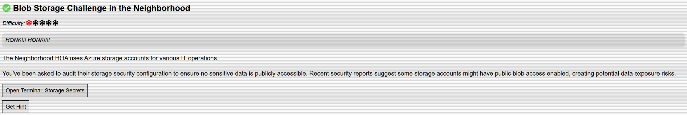
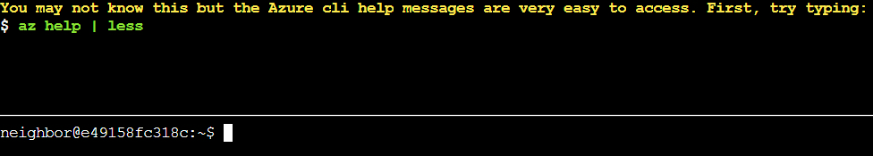
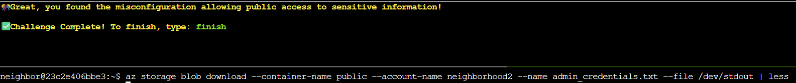

# Blob Storage Challenge in the Neighborhood

## Challenge Objective 



## Challenge Solution

This challenge involves auditing Azure storage to make sure sensitive data isn't exposed. 



Similar to other challenges, clicking open terminal shows a pop up window with a Linux terminal. The top of the window shows the question, and the bottom is where I enter my commands.

### Question 1

Here, I just need to type the supplied ```az help | less``` command to proceed. This brings up a lot of help info for the Azure CLI, which I can page through with the spacebar.

### Question 2

```
Next, you've already been configured with credentials. 🔑
  $ az account show | less
  - Pipe the output to | less so you can scroll.
  - Press 'q' to exit less.
```

I quit less from the previous command with q and type in the supplied command to proceed.   

```az account show | less```

```json
{
  "environmentName": "AzureCloud",
  "id": "2b0942f3-9bca-484b-a508-abdae2db5e64",
  "isDefault": true,
  "name": "theneighborhood-sub",
  "state": "Enabled",
  "tenantId": "90a38eda-4006-4dd5-924c-6ca55cacc14d",
  "user": {
    "name": "theneighborhood@theneighborhood.invalid",
    "type": "user"
  }
}
```

### Question 3

```
Now that you've run a few commands, Let's take a look at some Azure storage accounts.
Try: az storage account list | less
For more information:
https://learn.microsoft.com/en-us/cli/azure/storage/account?view=azure-cli-latest
```

I exit less with q again, and type in the supplied command. 

```az storage account list | less```

```json
[
  {
    "id": "/subscriptions/2b0942f3-9bca-484b-a508-abdae2db5e64/resourceGroups/theneighborhood-rg1/providers/Microsoft.Storage/storageAccounts/neighborhood1",
    "kind": "StorageV2",
    "location": "eastus",
    "name": "neighborhood1",
    "properties": {
      "accessTier": "Hot",
      "allowBlobPublicAccess": false,
      "encryption": {
        "keySource": "Microsoft.Storage",
        "services": {
          "blob": {
            "enabled": true
          }
        }
      },
      "minimumTlsVersion": "TLS1_2"
    },
    "resourceGroup": "theneighborhood-rg1",
    "sku": {
      "name": "Standard_LRS"
    },
    "tags": {
      "env": "dev"
    }
  },
    {
    "id": "/subscriptions/2b0942f3-9bca-484b-a508-abdae2db5e64/resourceGroups/theneighborhood-rg1/providers/Microsoft.Storage/storageAccounts/neighborhood2",
    "kind": "StorageV2",
    "location": "eastus2",
    "name": "neighborhood2",
    "properties": {
      "accessTier": "Cool",
      "allowBlobPublicAccess": true,
      "encryption": {
        "keySource": "Microsoft.Storage",
        "services": {
          "blob": {
            "enabled": false
          }
        }
      },
      "minimumTlsVersion": "TLS1_0"
    },
    "resourceGroup": "theneighborhood-rg1",
    "sku": {
      "name": "Standard_GRS"
    },
    "tags": {
      "owner": "Admin"
    }
  },
    {
    "id": "/subscriptions/2b0942f3-9bca-484b-a508-abdae2db5e64/resourceGroups/theneighborhood-rg2/providers/Microsoft.Storage/storageAccounts/neighborhood3",
    "kind": "BlobStorage",
    "location": "westus",
    "name": "neighborhood3",
    "properties": {
      "accessTier": "Hot",
      "allowBlobPublicAccess": false,
      "encryption": {
        "keySource": "Microsoft.Keyvault",
        "services": {
          "blob": {
            "enabled": true
          }
        }
      },
      "minimumTlsVersion": "TLS1_2"
    },
    "resourceGroup": "theneighborhood-rg2",
    "sku": {
      "name": "Standard_RAGRS"
    },
    "tags": {
      "department": "NeighborhoodWatch"
    }
  },
    {
    "id": "/subscriptions/2b0942f3-9bca-484b-a508-abdae2db5e64/resourceGroups/theneighborhood-rg2/providers/Microsoft.Storage/storageAccounts/neighborhood4",
    "kind": "StorageV2",
    "location": "westus2",
    "name": "neighborhood4",
    "properties": {
      "accessTier": "Hot",
      "allowBlobPublicAccess": false,
      "minimumTlsVersion": "TLS1_2",
      "networkAcls": {
        "bypass": "AzureServices",
        "virtualNetworkRules": []
      }
    },
    "resourceGroup": "theneighborhood-rg2",
    "sku": {
      "name": "Premium_LRS"
    },
    "tags": {
      "critical": "true"
    }
  },
    {
    "id": "/subscriptions/2b0942f3-9bca-484b-a508-abdae2db5e64/resourceGroups/theneighborhood-rg1/providers/Microsoft.Storage/storageAccounts/neighborhood5",
    "kind": "StorageV2",
    "location": "eastus",
    "name": "neighborhood5",
    "properties": {
      "accessTier": "Cool",
      "allowBlobPublicAccess": false,
      "isHnsEnabled": true,
      "minimumTlsVersion": "TLS1_2"
    },
    "resourceGroup": "theneighborhood-rg1",
    "sku": {
      "name": "Standard_LRS"
    },
    "tags": {
      "project": "Homes"
    }
  },
    {
    "id": "/subscriptions/2b0942f3-9bca-484b-a508-abdae2db5e64/resourceGroups/theneighborhood-rg2/providers/Microsoft.Storage/storageAccounts/neighborhood6",
    "kind": "StorageV2",
    "location": "centralus",
    "name": "neighborhood6",
    "properties": {
      "accessTier": "Hot",
      "allowBlobPublicAccess": false,
      "minimumTlsVersion": "TLS1_2",
      "tags": {
        "replicate": "true"
      }
    },
    "resourceGroup": "theneighborhood-rg2",
    "sku": {
      "name": "Standard_ZRS"
    },
    "tags": {}
  }
]
```

### Question 4

```
hmm... one of these looks suspicious 🚨, i think there may be a misconfiguration here somewhere.
Try showing the account that has a common misconfiguration: az storage account show --name xxxxxxxxxx | less
```

The string of Xs in the supplied command should be replaced with the account names I saw in the previous command to show the accounts, neighborhood1-6.

I start with looking for the misconfiguration with neighborhood1 with ```az storage account show --name neighborhood1 | less```. That did not advance the challenge, but looking for neighborhood2 did. 

```az storage account show --name neighborhood2 | less```

```json
{
  "id": "/subscriptions/2b0942f3-9bca-484b-a508-abdae2db5e64/resourceGroups/theneighborhood-rg1/providers/Microsoft.Storage/storageAccounts/neighborhood2",
  "name": "neighborhood2",
  "location": "eastus2",
  "kind": "StorageV2",
  "sku": {
    "name": "Standard_GRS"
  },
  "properties": {
    "accessTier": "Cool",
    "allowBlobPublicAccess": true,
    "minimumTlsVersion": "TLS1_0",
    "encryption": {
      "services": {
        "blob": {
          "enabled": false
        }
      },
      "keySource": "Microsoft.Storage"
    }
  },
  "resourceGroup": "theneighborhood-rg1",
  "tags": {
    "owner": "Admin"
  }
}
```

### Question 5

```
Now we need to list containers in neighborhood2. After running the command what's interesting in the list?
For more information:
https://learn.microsoft.com/en-us/cli/azure/storage/container?view=azure-cli-latest#az-storage-container-list
```

I looked at the linked Azure CLI documentation to learn how to use the ```az storage container list``` command. 

I know that I need to look for neighborhood2, which is the account name. So now it's just about supplying that info to the Azure command as an argument. 

```az storage container list --account-name neighborhood2``` 

```json
[
  {
    "name": "public",
    "properties": {
      "lastModified": "2024-01-15T09:00:00Z",
      "publicAccess": "Blob"
    }
  },
  {
    "name": "private",
    "properties": {
      "lastModified": "2024-02-05T11:12:00Z",
      "publicAccess": null
    }
  }
]
```

Since I want to look for publicly exposed sensitive data, I need to craft a command to list files within a container. This container is publicly accessible, while the private container is not. 

I use the ```az storage blob list``` command to do this, passing the container name and the account name. 

```az storage blob list --container-name public --account-name neighborhood2``` 

```json
[
  {
    "name": "refrigerator_inventory.pdf",
    "properties": {
      "contentLength": 45678,
      "contentType": "application/pdf",
      "metadata": {
        "created_by": "NeighborhoodWatch",
        "document_type": "inventory",
        "last_updated": "2024-12-15"
      }
    }
  },
  {
    "name": "admin_credentials.txt",
    "properties": {
      "contentLength": 1024,
      "contentType": "text/plain",
      "metadata": {
        "note": "admins only"
      }
    }
  },
  {
    "name": "network_config.json",
    "properties": {
      "contentLength": 2048,
      "contentType": "application/json",
      "metadata": {
        "encrypted": "false",
        "environment": "prod"
      }
    }
  }
]
```

Admin credentials are exposed publicly to the internet via the public container.

### Question 6

```
Try downloading and viewing the blob file named admin_credentials.txt from the public container.
💡 hint: --file /dev/stdout should print in the terminal. Dont forget to use | less!
```

I look up how to download files from an Azure blob and learn about the ```az storage blob download``` command. I need to supply the container name, account name, and name of the file. The question gives me a hint on how to end my command. 

```
az storage blob download --container-name public --account-name neighborhood2 --name admin_credentials.txt --file /dev/stdout | less 
```

```
# You have discovered an Azure Storage account with "allowBlobPublicAccess": true.
# This misconfiguration allows ANYONE on the internet to view and download files
# from the blob container without authentication.

# Public blob access is highly insecure when sensitive data (like admin credentials)
# is stored in these containers. Always disable public access unless absolutely required.

Azure Portal Credentials
User: azureadmin
Pass: AzUR3!P@ssw0rd#2025

Windows Server Credentials
User: administrator
Pass: W1nD0ws$Srv!@42

SQL Server Credentials
User: sa
Pass: SqL!P@55#2025$

Active Directory Domain Admin
User: corp\administrator
Pass: D0m@in#Adm!n$765

Exchange Admin Credentials
User: exchangeadmin
Pass: Exch@ng3!M@il#432

VMware vSphere Credentials
User: vsphereadmin
Pass: VMW@r3#Clu$ter!99

Network Switch Credentials
User: netadmin
Pass: N3t!Sw!tch$C0nfig#

Firewall Admin Credentials
User: fwadmin
Pass: F1r3W@ll#S3cur3!77

Backup Server Credentials
User: backupadmin
Pass: B@ckUp!Srv#2025$

Monitoring System Admin
User: monitoradmin
Pass: M0n!t0r#Sys$P@ss!

SharePoint Admin Credentials
User: spadmin
Pass: Sh@r3P0!nt#Adm!n2025

Git Server Admin
User: gitadmin
Pass: G1t#Srv!Rep0$C0de
```



This is the last question for this challenge. I type finish to complete the challenge officially.  