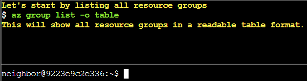
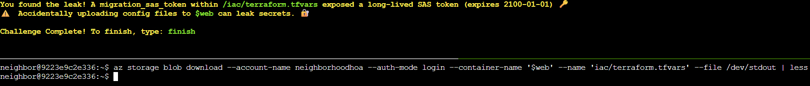

# Spare Key

## Challenge Objective 


## Challenge Solution

Like some previous challenges, I must solve this one within a pop-up Linux terminal. 



### Question 1

```
Let's start by listing all resource groups
$ az group list -o table
This will show all resource groups in a readable table format.
```

I enter the supplied command to list all resource groups. 

```
neighbor@9223e9c2e336:~$ az group list -o table
Name                 Location    ProvisioningState
-------------------  ----------  -------------------
rg-the-neighborhood  eastus      Succeeded
rg-hoa-maintenance   eastus      Succeeded
rg-hoa-clubhouse     eastus      Succeeded
rg-hoa-security      eastus      Succeeded
rg-hoa-landscaping   eastus      Succeeded
```

### Question 2  

```
Now let's find storage accounts in the neighborhood resource group 📦
$ az storage account list --resource-group rg-the-neighborhood -o table
This shows what storage accounts exist and their types.
```

I enter the supplied command to see what storage account exists and what their types are. 

```
neighbor@9223e9c2e336:~$ az storage account list --resource-group rg-the-neighborhood -o table
Name             Kind         Location    ResourceGroup        ProvisioningState
---------------  -----------  ----------  -------------------  -------------------
neighborhoodhoa  StorageV2    eastus      rg-the-neighborhood  Succeeded
hoamaintenance   StorageV2    eastus      rg-hoa-maintenance   Succeeded
hoaclubhouse     StorageV2    eastus      rg-hoa-clubhouse     Succeeded
hoasecurity      BlobStorage  eastus      rg-hoa-security      Succeeded
hoalandscaping   StorageV2    eastus      rg-hoa-landscaping   Succeeded
```

### Question 3

```
Someone mentioned there was a website in here.
maybe a static website?
try:$ az storage blob service-properties show --account-name <insert_account_name> --auth-mode login
```

I need to test the supplied command, filling in the account names from the above question. I start with the top account name, ```neighborhoodhoa```. This works and I proceed to the next question.

```
neighbor@9223e9c2e336:~$ az storage blob service-properties show --account-name neighborhoodhoa --auth-mode login 
{
  "enabled": true,
  "errorDocument404Path": "404.html",
  "indexDocument": "index.html"
}
```

### Question 4 

```
Let's see what 📦 containers exist in the storage account
💡 Hint: You will need to use az storage container list
We want to list the container and its public access levels.
```

Since the hint mentions what command to use, I look up the official Azure documentation for the ```az storage container list``` command. 

I use the ```-account-name``` and ```-auth-mode``` arguments from the command in the previous question here.

```
neighbor@9223e9c2e336:~$ az storage container list --account-name neighborhoodhoa --auth-mode login 
[
  {
    "name": "$web",
    "properties": {
      "lastModified": "2025-09-20T10:30:00Z",
      "publicAccess": null
    }
  },
  {
    "name": "public",
    "properties": {
      "lastModified": "2025-09-15T14:20:00Z",
      "publicAccess": "Blob"
    }
  }
]
```

### Question 5

```
Examine what files are in the static website container
💡 hint: when using --container-name you might need '<name>'
Look 👀 for any files that shouldn't be publicly accessible!
```

The ```az storage blob list``` command lists all storage blobs in a container. I need to use the ```--account-name```, ```--auth-mode```, and ```--container-name arguments```. 

```
neighbor@9223e9c2e336:~$ az storage blob list --account-name neighborhoodhoa --auth-mode login --container-name '$web'
[
  {
    "name": "index.html",
    "properties": {
      "contentLength": 512,
      "contentType": "text/html",
      "metadata": {
        "source": "hoa-website"
      }
    }
  },
  {
    "name": "about.html",
    "properties": {
      "contentLength": 384,
      "contentType": "text/html",
      "metadata": {
        "source": "hoa-website"
      }
    }
  },
  {
    "name": "iac/terraform.tfvars",
    "properties": {
      "contentLength": 1024,
      "contentType": "text/plain",
      "metadata": {
        "WARNING": "LEAKED_SECRETS"
      }
    }
  }
]
```

### Question 6

```
Take a look at the files here, what stands out?
Try examining a suspect file 🕵️:
💡 hint: --file /dev/stdout | less will print to your terminal 💻.
```

Upon looking at the file names in the static website container within the output of my previous command, I see that the ```iac/terraform.tfvars``` file has a warning in the metadata, ```LEAKED_SECRETS```.

I want to look at this file's contents. The hint in this question makes me think of a similar hint to the last question for the previous challenge, Blob Storage Challenge in the Neighborhood. 

I need to download this file in order to inspect it. For this, I'll need to use the ```az storage blob download``` command and pass the right arguments used previously in this challenge, as well as the hinted command at the end. 

```
az storage blob download --account-name neighborhoodhoa --auth-mode login --container-name '$web' --name 'iac/terraform.tfvars' --file /dev/stdout | less
```

```
# Terraform Variables for HOA Website Deployment
# Application: Neighborhood HOA Service Request Portal  
# Environment: Production
# Last Updated: 2025-09-20
# DO NOT COMMIT TO PUBLIC REPOS

# === Application Configuration ===
app_name = "hoa-service-portal"
app_version = "2.1.4"
environment = "production"

# === Database Configuration ===
database_server = "sql-neighborhoodhoa.database.windows.net"
database_name = "hoa_requests"
database_username = "hoa_app_user"
# Using Key Vault reference for security
database_password_vault_ref = "@Microsoft.KeyVault(SecretUri=https://kv-neighborhoodhoa-prod.vault.azure.net/secrets/db-password/)"

# === Storage Configuration for File Uploads ===
storage_account = "neighborhoodhoa"
uploads_container = "resident-uploads"
documents_container = "hoa-documents"

# TEMPORARY: Direct storage access for migration script
# WARNING: Remove after data migration to new storage account
# This SAS token provides full access - HIGHLY SENSITIVE!
migration_sas_token = "sv=2023-11-03&ss=b&srt=co&sp=rlacwdx&se=2100-01-01T00:00:00Z&spr=https&sig=1djO1Q%2Bv0wIh7mYi3n%2F7r1d%2F9u9H%2F5%2BQxw8o2i9QMQc%3D"

# === Email Service Configuration ===
# Using Key Vault for sensitive email credentials
sendgrid_api_key_vault_ref = "@Microsoft.KeyVault(SecretUri=https://kv-neighborhoodhoa-prod.vault.azure.net/secrets/sendgrid-key/)"
from_email = "noreply@theneighborhood.com" 
admin_email = "admin@theneighborhood.com"

# === Application Settings ===
session_timeout_minutes = 60
max_file_upload_mb = 10
allowed_file_types = ["pdf", "jpg", "jpeg", "png", "doc", "docx"]

# === Feature Flags ===
enable_online_payments = true
enable_maintenance_requests = true
enable_document_portal = false
enable_resident_directory = true

# === API Keys (Key Vault References) ===
maps_api_key_vault_ref = "@Microsoft.KeyVault(SecretUri=https://kv-neighborhoodhoa-prod.vault.azure.net/secrets/maps-api-key/)"
weather_api_key_vault_ref = "@Microsoft.KeyVault(SecretUri=https://kv-neighborhoodhoa-prod.vault.azure.net/secrets/weather-api-key/)"

# === Notification Settings (Key Vault References) ===
sms_service_vault_ref = "@Microsoft.KeyVault(SecretUri=https://kv-neighborhoodhoa-prod.vault.azure.net/secrets/sms-credentials/)"
notification_webhook_vault_ref = "@Microsoft.KeyVault(SecretUri=https://kv-neighborhoodhoa-prod.vault.azure.net/secrets/slack-webhook/)"

# === Deployment Configuration ===
deploy_static_files_to_cdn = true
cdn_profile = "hoa-cdn-prod"
cache_duration_hours = 24

# Backup schedule
backup_frequency = "daily"
backup_retention_days = 30
{
  "downloaded": true,
  "file": "/dev/stdout"
}
```

This last question completes this challenge. I type finish to complete the challenge. 

   