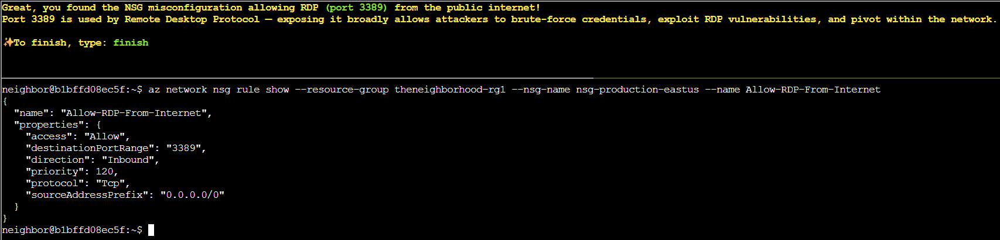

# The Open Door

## Challenge Objective 


## Challenge Solution

Like the previous two Azure CLI challenges, this one is completed within a pop-up Linux terminal.

### Question 1

```
Welcome back! Let's start by exploring output formats.
First, let's see resource groups in JSON format (the default):
$ az group list
JSON format shows detailed structured data.
```

I type the supplied command to look at resource groups in JSON. 

```
neighbor@898a71c902e5:~$ az group list
[
  {
    "id": "/subscriptions/2b0942f3-9bca-484b-a508-abdae2db5e64/resourceGroups/theneighborhood-rg1",
    "location": "eastus",
    "managedBy": null,
    "name": "theneighborhood-rg1",
    "properties": {
      "provisioningState": "Succeeded"
    },
    "tags": {}
  },
  {
    "id": "/subscriptions/2b0942f3-9bca-484b-a508-abdae2db5e64/resourceGroups/theneighborhood-rg2",
    "location": "westus",
    "managedBy": null,
    "name": "theneighborhood-rg2",
    "properties": {
      "provisioningState": "Succeeded"
    },
    "tags": {}
  }
]
```

### Question 2 

```
Great! Now let's see the same data in table format for better readability 👀
$ az group list -o table
Notice how -o table changes the output format completely!
Both commands show the same data, just formatted differently.
```

I type the supplied command to see the same data in the output for the above command in a cleaner format. 

```
neighbor@898a71c902e5:~$ az group list -o table
Name                 Location    ProvisioningState
-------------------  ----------  -------------------
theneighborhood-rg1  eastus      Succeeded
theneighborhood-rg2  westus      Succeeded
```

### Question 3

```
Lets take a look at Network Security Groups (NSGs).
To do this try: az network nsg list -o table
This lists all NSGs across resource groups.
For more information:
https://learn.microsoft.com/en-us/cli/azure/network/nsg?view=azure-cli-latest
```

I enter the supplied command to list all the NSGs.

```
neighbor@898a71c902e5:~$ az network nsg list -o table
Location    Name                   ResourceGroup
----------  ---------------------  -------------------
eastus      nsg-web-eastus         theneighborhood-rg1
eastus      nsg-db-eastus          theneighborhood-rg1
eastus      nsg-dev-eastus         theneighborhood-rg2
eastus      nsg-mgmt-eastus        theneighborhood-rg2
eastus      nsg-production-eastus  theneighborhood-rg1
```

### Question 4

```
Inspect the Network Security Group (web)  🕵️
Here is the NSG and its resource group:--name nsg-web-eastus --resource-group theneighborhood-rg1 

Hint: We want to show the NSG details. Use | less to page through the output.
Documentation: https://learn.microsoft.com/en-us/cli/azure/network/nsg?view=azure-cli-latest#az-network-nsg-show
```

The ```az network nsg show``` command displays information about a NSG. Knowing this I need to create the right command with the aid of the arguments and the hint in the question.

```
az network nsg show --name nsg-web-eastus --resource-group theneighborhood-rg1 | less
```

```json
{
  "id": "/subscriptions/2b0942f3-9bca-484b-a508-abdae2db5e64/resourceGroups/theneighborhood-rg1/providers/Microsoft.Network/networkSecurityGroups/nsg-web-eastus",
  "location": "eastus",
  "name": "nsg-web-eastus",
  "properties": {
    "securityRules": [
      {
        "name": "Allow-HTTP-Inbound",
        "properties": {
          "access": "Allow",
          "destinationPortRange": "80",
          "direction": "Inbound",
          "priority": 100,
          "protocol": "Tcp",
          "sourceAddressPrefix": "0.0.0.0/0"
        }
      },
      {
        "name": "Allow-HTTPS-Inbound",
        "properties": {
          "access": "Allow",
          "destinationPortRange": "443",
          "direction": "Inbound",
          "priority": 110,
          "protocol": "Tcp",
          "sourceAddressPrefix": "0.0.0.0/0"
        }
      },
      {
        "name": "Allow-AppGateway-HealthProbes",
        "properties": {
          "access": "Allow",
          "destinationPortRange": "80,443",
          "direction": "Inbound",
          "priority": 130,
          "protocol": "Tcp",
          "sourceAddressPrefix": "AzureLoadBalancer"
        }
      },
      {
        "name": "Allow-Web-To-App",
        "properties": {
          "access": "Allow",
          "destinationPortRange": "8080,8443",
          "direction": "Inbound",
          "priority": 200,
          "protocol": "Tcp",
          "sourceAddressPrefix": "VirtualNetwork"
        }
      },
      {
        "name": "Deny-All-Inbound",
        "properties": {
          "access": "Deny",
          "destinationPortRange": "*",
          "direction": "Inbound",
          "priority": 4096,
          "protocol": "*",
          "sourceAddressPrefix": "*"
        }
      }
    ]
  },
  "resourceGroup": "theneighborhood-rg1",
  "tags": {
    "env": "web"
  }
}
```

### Question 5

```
Inspect the Network Security Group (mgmt)  🕵️
Here is the NSG and its resource group:--nsg-name nsg-mgmt-eastus --resource-group theneighborhood-rg2 

Hint: We want to list the NSG rules
Documentation: https://learn.microsoft.com/en-us/cli/azure/network/nsg/rule?view=azure-cli-latest#az-network-nsg-rule-list
```

Getting the NSG rule list for this question involves using a different command than showing the NSG details in the previous question. To complete this question, I need to use the ```az network nsg rule list``` command with the arguments provided in this question.  

```
az network nsg rule list --nsg-name nsg-mgmt-eastus --resource-group theneighborhood-rg2
```

```json
[
  {
    "name": "Allow-AzureBastion",
    "nsg": "nsg-mgmt-eastus",
    "properties": {
      "access": "Allow",
      "destinationPortRange": "443",
      "direction": "Inbound",
      "priority": 100,
      "protocol": "Tcp",
      "sourceAddressPrefix": "AzureBastion"
    }
  },
  {
    "name": "Allow-Monitoring-Inbound",
    "nsg": "nsg-mgmt-eastus",
    "properties": {
      "access": "Allow",
      "destinationPortRange": "443",
      "direction": "Inbound",
      "priority": 110,
      "protocol": "Tcp",
      "sourceAddressPrefix": "AzureMonitor"
    }
  },
  {
    "name": "Allow-DNS-From-VNet",
    "nsg": "nsg-mgmt-eastus",
    "properties": {
      "access": "Allow",
      "destinationPortRange": "53",
      "direction": "Inbound",
      "priority": 115,
      "protocol": "Udp",
      "sourceAddressPrefix": "VirtualNetwork"
    }
  },
  {
    "name": "Deny-All-Inbound",
    "nsg": "nsg-mgmt-eastus",
    "properties": {
      "access": "Deny",
      "destinationPortRange": "*",
      "direction": "Inbound",
      "priority": 4096,
      "protocol": "*",
      "sourceAddressPrefix": "*"
    }
  },
  {
    "name": "Allow-Monitoring-Outbound",
    "nsg": "nsg-mgmt-eastus",
    "properties": {
      "access": "Allow",
      "destinationAddressPrefix": "AzureMonitor",
      "destinationPortRange": "443",
      "direction": "Outbound",
      "priority": 200,
      "protocol": "Tcp"
    }
  },
  {
    "name": "Allow-AD-Identity-Outbound",
    "nsg": "nsg-mgmt-eastus",
    "properties": {
      "access": "Allow",
      "destinationAddressPrefix": "AzureActiveDirectory",
      "destinationPortRange": "443",
      "direction": "Outbound",
      "priority": 210,
      "protocol": "Tcp"
    }
  },
  {
    "name": "Allow-Backup-Outbound",
    "nsg": "nsg-mgmt-eastus",
    "properties": {
      "access": "Allow",
      "destinationAddressPrefix": "AzureBackup",
      "destinationPortRange": "443",
      "direction": "Outbound",
      "priority": 220,
      "protocol": "Tcp"
    }
  }
]    
```

### Question 6

```
Take a look at the rest of the NSG rules and examine their properties.
After enumerating the NSG rules, enter the command string to view the suspect rule and inspect its properties.
Hint: Review fields such as direction, access, protocol, source, destination and port settings.

Documentation: https://learn.microsoft.com/en-us/cli/azure/network/nsg/rule?view=azure-cli-latest#az-network-nsg-rule-show
```

First, I review the output of my above command looking at the rules for the ```nsg-mgmt-eastus``` NSG in the resource group ```theneighborhood-rg2```, but I don't see anything suspicious.

So, I need to use the ```az network nsg rule list``` command with the different NSGs and resource groups discovered in previous questions to find the suspect rule. 

I run the below command to see all of the NSGs across the two resource groups again.

```
neighbor@b1bffd08ec5f:~$ az network nsg list -o table 
Location    Name                   ResourceGroup
----------  ---------------------  -------------------
eastus      nsg-web-eastus         theneighborhood-rg1
eastus      nsg-db-eastus          theneighborhood-rg1
eastus      nsg-dev-eastus         theneighborhood-rg2
eastus      nsg-mgmt-eastus        theneighborhood-rg2
eastus      nsg-production-eastus  theneighborhood-rg1
```

I use the generic format of ```az network nsg rule list --nsg-name <nsg-name> --resource-group <theneighborhood-rg2/theneighborhood-rg1> | less``` to look at the other rules for all of the NSGs. 

I check the rules for each NSG in both resource groups using the commands below. 

* ```az network nsg rule list --nsg-name nsg-web-eastus --resource-group theneighborhood-rg1 | less```
* ```az network nsg rule list --nsg-name nsg-db-eastus --resource-group theneighborhood-rg1 | less```
* ```az network nsg rule list --nsg-name nsg-dev-eastus --resource-group theneighborhood-rg2 | less```
* ```az network nsg rule list --nsg-name nsg-mgmt-eastus --resource-group theneighborhood-rg2 | less```
* ```az network nsg rule list --nsg-name nsg-production-eastus --resource-group theneighborhood-rg1 | less```

Upon investigating the ```nsg-production-eastus``` NSG in the resource group ```theneighborhood-rg1```, I see a suspicious command. 

```
az network nsg rule list --nsg-name nsg-production-eastus --resource-group theneighborhood-rg1 | less 
```

```json
[
  {
    "name": "Allow-HTTP-Inbound",
    "nsg": "nsg-production-eastus",
    "properties": {
      "access": "Allow",
      "destinationPortRange": "80",
      "direction": "Inbound",
      "priority": 100,
      "protocol": "Tcp",
      "sourceAddressPrefix": "0.0.0.0/0"
    }
  },
  {
    "name": "Allow-HTTPS-Inbound",
    "nsg": "nsg-production-eastus",
    "properties": {
      "access": "Allow",
      "destinationPortRange": "443",
      "direction": "Inbound",
      "priority": 110,
      "protocol": "Tcp",
      "sourceAddressPrefix": "0.0.0.0/0"
    }
  },
  {
    "name": "Allow-AppGateway-HealthProbes",
    "nsg": "nsg-production-eastus",
    "properties": {
      "access": "Allow",
      "destinationPortRange": "80,443",
      "direction": "Inbound",
      "priority": 115,
      "protocol": "Tcp",
      "sourceAddressPrefix": "AzureLoadBalancer"
    }
  },
  {
    "name": "Allow-RDP-From-Internet",
    "nsg": "nsg-production-eastus",
    "properties": {
      "access": "Allow",
      "destinationPortRange": "3389",
      "direction": "Inbound",
      "priority": 120,
      "protocol": "Tcp",
      "sourceAddressPrefix": "0.0.0.0/0"
    }
  },
  {
    "name": "Deny-All-Inbound",
    "nsg": "nsg-production-eastus",
    "properties": {
      "access": "Deny",
      "destinationPortRange": "*",
      "direction": "Inbound",
      "priority": 4096,
      "protocol": "*",
      "sourceAddressPrefix": "*"
    }
  }
]
```

The ```Allow-RDP-From-Internet``` rule is suspicious to me since port 3389 is exposed. This, combined with the source of ```0.0.0.0/0``` means that anyone on the internet can attempt to connect to the port. 

There is a ```Deny-All-Inbound``` rule below the above rule, but it is lower priority. This is because with NSG rules, a lower number is a higher priority, while a higher number is a lower priority.

Since the ```Allow-RDP-From-Internet``` rule takes higher priority than ```Deny-All-Inbound``` rule, it will be matched. Azure won't hit the Deny rule. 

Now that I know that the ```Allow-RDP-From-Internet``` rule is the suspicious rule that exposes production systems to internet attacks, I have to create a command to show more details about the rule. 

I use the ```az network nsg rule show``` command, and with the help of the documentation in the question craft the below command.

```
neighbor@b1bffd08ec5f:~$ az network nsg rule show --resource-group theneighborhood-rg1 --nsg-name nsg-production-eastus --name Allow-RDP-From-Internet 
{
  "name": "Allow-RDP-From-Internet",
  "properties": {
    "access": "Allow",
    "destinationPortRange": "3389",
    "direction": "Inbound",
    "priority": 120,
    "protocol": "Tcp",
    "sourceAddressPrefix": "0.0.0.0/0"
  }
}
```

This is the last question, and now I just have to type finish in the terminal to officially complete the challenge. 

  