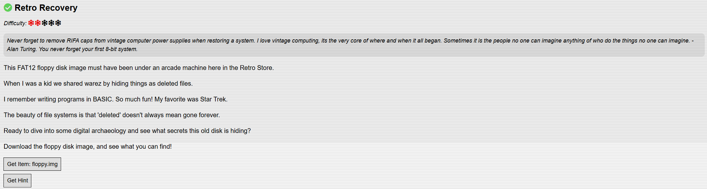
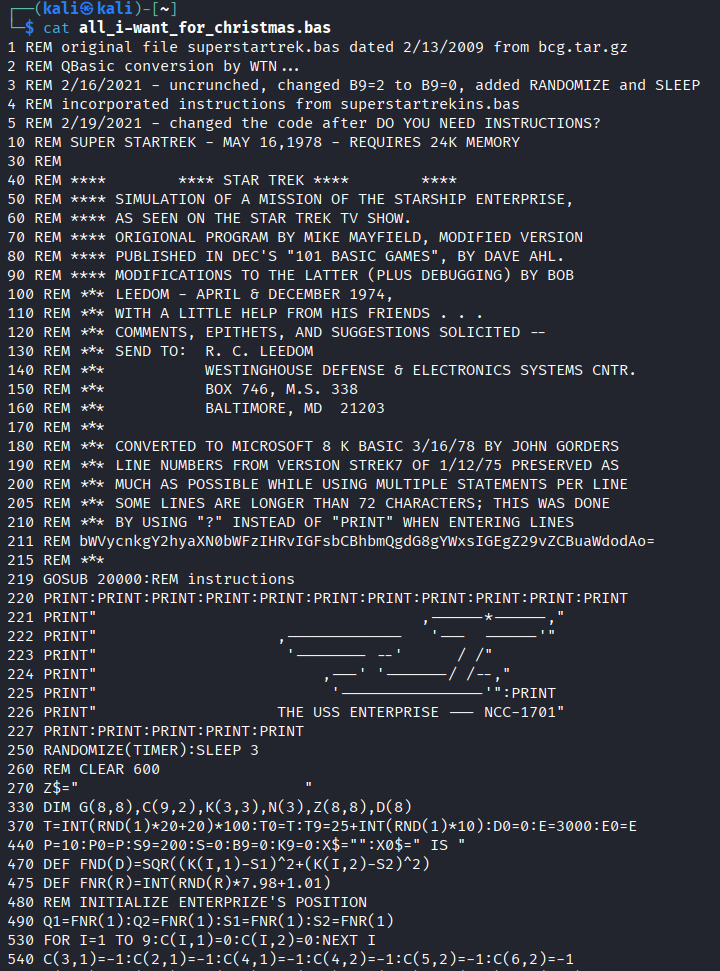

# Retro Recovery

## Challenge Objective



## Challenge Solution

First, I download the ```floppy.img``` file to my Kali Linux VM.

I create a mount point:
* ```sudo mkdir /mnt/floppy```.

Next, I mount the image:
* ```sudo mount -o loop,ro -t vfat floppy.img /mnt/floppy```

Lastly, I test that I can browse the image as a file system:
```
$ ls -l /mnt/floppy
total 1
drwxr-xr-x 2 root root 512 Mar 18  2025 qb45
```

I can see the contents of the ```floppy.img``` file, so next I change to the directory to start looking at the files with ```cd /mnt/floppy```. 

After changing to the image directory, I run ```ls``` and see just one directory, ```qb45```. I then ```cd``` into that directory, and run ```ls``` again. I find multiple files in the output of ```ls /mnt/floppy/qb45```.

```
BC.EXE  BRUN45.EXE  LIB.EXE  LINK.EXE  MOUSE.COM  PACKING.LST.txt  QB.EXE  QB.INI
```

After looking at some of the files in the image and not getting anywhere, I think of looking for deleted files and deleted content within files. 

I run the below command and find two deleted files after changing my directory to where I have the ```floppy.img``` file saved.

```
$ fls -rd floppy.img
r/r * 6:        all_i-want_for_christmas.bas
r/r * 10:       .all_i-want_f
```

I look into how to recover the first file. I found out that I can use the ```icat``` command to do this, and that I need to use the number next to the file name (the inode number) to recover the file. 

```
icat floppy.img 6 > all_i-want_for_christmas.bas
```

I was able to recover the file successfully, so next I looked at the contents of the ```all_i-want_for_christmas.bas``` file with the ```cat``` command. 



This file is a retro Star Trek game coded in BASIC. A hint on the Discord server said to look for something that stands out in the file, and I see an encoded string on line 211.

I run the below command to decode the string, with the result being the flag ```merry christmas to all and to all a good night```.

```
$ echo "bWVycnkgY2hyaXN0bWFzIHRvIGFsbCBhbmQgdG8gYWxsIGEgZ29vZCBuaWdodAo=" | base64 -d 
merry christmas to all and to all a good night
```

I enter the decoded string into the textbox shown in the challenge objective and successfully complete the challenge.   