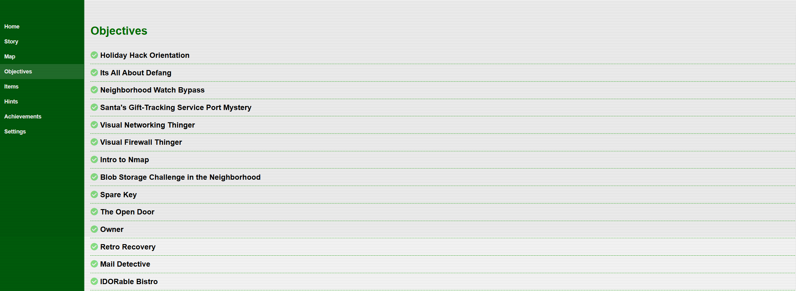

# Intro 

This repository is my submission for the 2025 SANS Holiday Hack Challenge contest, which is generously provided to the IT and cybersecurity community by SANS and Counter Hack.

I have different folders for the 13 challenges I have completed so far, split into two main folders for Act I and Act II. Within each folder is a separate markdown file for each challenge within that act.

As of the time of submission, I have completed the below challenges.

Below is a list of links to my individual challenge write-ups. I want to give a huge thank you to SANS and Counter Hack for creating and providing such a great learning experience! 

Please see the challenge page at [SANS Holiday Hack Challenge™ 2025](https://www.sans.org/cyber-ranges/holiday-hack-challenge). The challenge topics for this year include defanging IOCs, using SUDO, port discovery, forensic analysis, basic networking, firewall basics, Nmap basics, CURL basics, IDOR challenge, using POCs, Java deserialization, Quantum computing, reverse engineering, hacking SQLI, Linux and PrivEsc, and WebApp Pentesting.

# Challenge Write-ups - Include Links after uploading to GitHub

## Act I

* [Its All About Defang](https://github.com/Rockman-Blue/SANS_HHC_2025/blob/1b96e79ef102d0791dc49472d5b203f4fa12fbb3/Act%20I/Markdown%20Files/1.1-Its-All-About-Defang.md)
* Neighborhood Watch Bypass
* Santa's Gift-Tracking Service Port Mystery
* Visual Networking Thinger
* Visual Firewall Thinger
* Intro to Nmap
* Blob Storage Challenge in the Neighborhood
* Spare Key
* The Open Door
* Owner

## Act II

* Retro Recovery
* Mail Detective
* IDORable Bistro   

